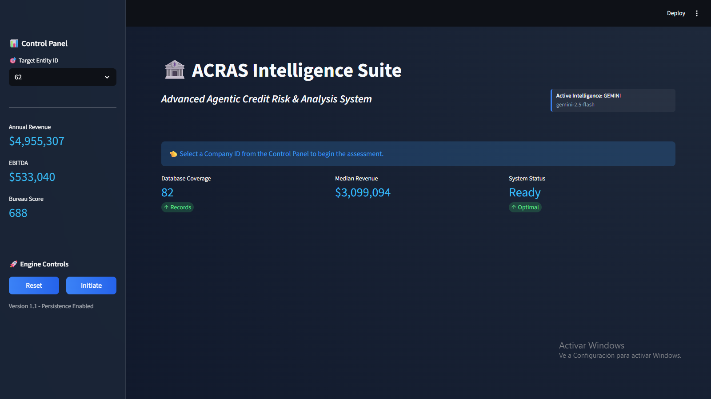
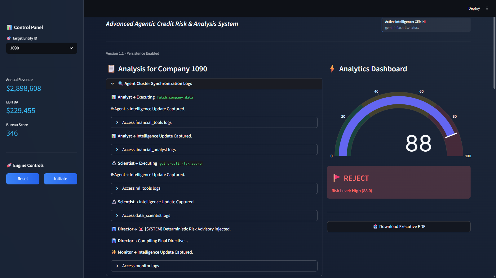

# ACRAS: Agentic Credit Risk & Analysis System

<div align="center">
  
  <p align="center">
    <b>"The Brain (Agent) directs; The Hands (Tools) execute."</b>
  </p>
</div>

<div align="center">
  
  
  
  
  
</div>

---

## 🚀 The Vision: Transforming Corporate Risk Assessment

**ACRAS** is not just another credit scoring model; it is a **Hybrid Agentic MLOps System** designed for high-stakes corporate financial evaluations. By decoupling **Probabilistic Reasoning** (Large Language Models) from **Deterministic Execution** (Machine Learning models and Financial Rules), ACRAS aims to eliminate the "hallucination problem" while providing deep, contextual risk narratives that traditional scoring engines cannot match.

### 🧠 The Agentic Brain (Orchestration)

Powered by **LangGraph**, ACRAS orchestrates a specialized cluster of AI agents following the **Separation of Concerns (Brain vs. Brawn)** principle:

1.  **📊 Financial Analyst Agent**: The auditor. Processes raw financial statements, calculates deterministic ratios (Liquidity, Solvency), and ensures data integrity.
2.  **🔬 Risk Data Scientist Agent**: The modeler. Interfaces with our **Inference Pipeline** (Proprietary ML models) to generate Probability of Default (PD) and risk classifications.
3.  **👔 Chief Risk Officer (Director)**: The synthesizer. Compiles all quantitative metrics and qualitative reasoning into an executive-grade directive using **High-Integrity Synthesis** to eliminate analytical bias.

---

## 🎨 Professional Interface & Experience

The system features a state-of-the-art **Modular Streamlit Dashboard** that provides full observability into the Agent Cluster's reasoning process. The UI has been fully decoupled into specialized components for production readiness and easier maintenance.

<div align="center">
  <table border="0">
    <tr>
      <td></td>
      <td></td>
    </tr>
    <tr>
      <td align="center"><i>Comprehensive Financial Dashboard</i></td>
      <td align="center"><i>Real-time Agentic Analysis Tracing</i></td>
    </tr>
  </table>
</div>

---

## 🛠️ Engineering Excellence: The FTI MLOps Pattern

ACRAS adheres to the **FTI (Feature, Training, Inference)** design pattern, ensuring that data engineering, model development, and serving are completely decoupled and independently scalable.

- **Feature Pipeline**: Managed with **DVC (Data Version Control)** and validated using **Great Expectations (GX)** to prevent schema drift.
- **Training Pipeline**: Experiment tracking with **MLflow**, including hyperparameter optimization and versioned model artifacts stored in a **Model Registry**.
- **Inference Pipeline**: A high-performance **FastAPI microservice** containerized with **Docker**, abstracting the ML complexity from the Agentic Brain.

### 🛡️ System Resilience & "Agentic Healing"

ACRAS is designed for 100% reliability in production through a multi-layered **Agentic Healing** architecture. The system doesn't just fail; it adapts.

1.  **3-Tier Model Resilience**:
    *   **Auto-Switch**: If the primary model (e.g., Qwen on HuggingFace) times out, the system automatically transitions to a cross-provider secondary (Gemini Pro) and finally to a high-availability safety net (Gemini Flash).
    *   **Implementation**: Controlled via the `invoke_with_fallback` engine in `src/agents/graph.py`.

2.  **Graceful Tool Degradation**:
    *   **Adaptive Strategy**: If the ML Inference API is unreachable, tools return descriptive guidance (e.g., *"Proceed with qualitative analysis only"*), allowing the Agent to self-correct its reasoning chain rather than crashing.
    *   **Safety**: All tools are Pydantic-validated to prevent halluncination-driven math errors.

3.  **Instructional Recovery**:
    *   **Prompt Pulse**: On every fallback transition, the engine injects a dynamic **"ROLE & GUIDELINES"** block into the prompt. This "heals" the reasoning process by stripping noise from the failing model and ensuring the new model adheres strictly to formatting contracts.

4.  **Stateful Observability**:
    *   **Chain-of-Failure Tracing**: Every error or fallback is recorded as a `🔄 Fallback` event in the LangGraph state. Downstream agents (like the CRO) read these "scars" and adjust the final risk narrative to reflect the data gaps, ensuring transparency for the end user.

---

## 📂 Documentation & Architecture

ACRAS is fully documented for both technical auditors and business stakeholders.

| Document | Description |
| :--- | :--- |
| [🧠 Agentic Reasoning Engine](reports/docs/architecture/agentic_reasoning_engine.md) | Deep dive into the LangGraph orchestration and 3-tier fallback logic. |
| [⚖️ LLM-as-a-Judge Architecture](reports/docs/architecture/llm_judge_architecture.md) | Automated qualitative evaluation harness with four business axes. |
| [📡 Observability & Tracing](reports/docs/architecture/observability_tracing.md) | OpenTelemetry (OTel) integration with Jaeger for distributed span analysis. |
| [🏗️ DVC Pipeline Architecture](reports/docs/architecture/dvc_pipeline_architecture.md) | 7-stage reproducible data & model lifecycle management. |
| [📊 MLflow Integration](reports/docs/architecture/mlflow_integration.md) | Experiment tracking, artifact registry, and live performance loops. |
| [🛡️ API Prediction Service](reports/docs/architecture/api_prediction_service.md) | Hardened FastAPI microservice with security headers and rate limiting. |
| [🐳 Containerization Report](reports/docs/architecture/containerization_report.md) | Production-grade multi-stage Docker orchestration with SHA-pinned digests. |
| [💻 Codebase Review v2.0](reports/docs/evaluations/codebase_review_v2.0.md) | Structural assessment of the MLOps FTI pattern implementation (9.9/10 maturity). |
| [📈 System Validation Report](reports/docs/evaluations/acras_system_validation_report.md) | Empirical results for Company 1090, confirming High-Integrity Synthesis. |

---

## 📄 Executive Reporting Examples

The system generates board-ready PDF reports that combine technical precision with business clarity.

<div align="center">
  <table width="100%">
    <tr>
      <td align="center">
        <a href="reports/figures/ACRAS_Report_22_huggingface.pdf">
          
        </a>
      </td>
      <td align="center">
        <a href="reports/figures/ACRAS_Report_59_gemini.pdf">
          
        </a>
      </td>
    </tr>
  </table>
</div>

---

## � Tech Stack & Tooling

| Layer | Technologies |
| :--- | :--- |
| **Agentic Brain** | LangGraph, LangChain, Google Gemini, Qwen2.5 |
| **ML Frameworks** | Scikit-Learn, Pandas, Numpy, Pydantic |
| **MLOps Core** | DVC, MLflow, Great Expectations (GX) |
| **Observability** | OpenTelemetry (OTel), Jaeger, Rich Logging |
| **API & Service** | FastAPI, Uvicorn, Docker, Docker Compose |
| **Frontend** | Streamlit, Plotly, Seaborn |
| **QA & CI/CD** | Pytest, Ruff, GitHub Actions, Pyright, Pre-commit |
| **Package Manager** | uv |

---

## 🚀 Getting Started

ACRAS is designed for rapid deployment using modern dependency management.

### 1. Installation
```bash
# Clone the repository
git clone https://github.com/SebastianGarrido2790/hybrid-agentic-ml-for-risk-assessment.git
cd hybrid-agentic-ml-for-risk-assessment

# Install dependencies via uv (fastest)
uv sync
```

### 1.2 Environment Configuration

Create a `.env` file in the root directory based on the provided `.env.example`. This file manages your connection to the AI backbones and experimental tracking.

```env
# Core API Keys
GOOGLE_API_KEY="your_gemini_api_key"
HUGGINGFACEHUB_API_TOKEN="your_hf_token"

# Optional Model Overrides
# GEMINI_POWER_MODEL=gemini-1.5-pro
# HF_MODEL=Qwen/Qwen2.5-7B-Instruct

# MLOps Config
MLFLOW_TRACKING_URI=http://127.0.0.1:5000
```

### 2. Launch the System
```powershell
# Option A: Start everything (Inference, Dashboard, and MLflow)
.\launch_acras.bat

# Option B: Start only the MLflow Tracking Server
.\launch_mlflow.bat

# Option C: Production Deployment via Docker Compose
docker-compose up --build
```

### 3. Monitoring
- **Streamlit Dashboard**: Visit `http://localhost:8501` for the full agentic UI.
- **MLflow UI**: Visit `http://localhost:5000` to inspect experiment metrics.
- **API Docs**: Visit `http://localhost:8000/docs` for the interactive Swagger UI.

---

## 🛡️ Testing & Quality Assurance

ACRAS implements a rigorous **Multi-Point Validation** strategy centered around four critical pillars of system health.

### The 4 Pillars of Validation
1.  **Static Logic & Type Safety**: Strict type hint coverage enforced via `pyright` (**0 errors**) and modular linting with `ruff`.
2.  **Functional Integrity**: Comprehensive unit testing with `pytest`, currently at **66% coverage**, with a mandatory CI gate.
3.  **Qualitative Evaluation**: Automated **LLM-as-a-Judge** scoring across Relevance, Faithfulness, Tool Usage, and Business Value.
4.  **Security & Supply Chain**: Trivy vulnerability scanning, SHA-pinned Docker images, and cryptographically verified GitHub Actions.
5.  **Deterministic Risk Guardrails**: Hardened orchestrator nodes to eliminate "optimistic bias" in high-risk profiles.

### Single-Command Validation
Developers can run the full battery of tests using the provided validation script:
```powershell
.\validate_system.bat
```

### CI/CD Integration
Every pull request triggers a **GitHub Actions** workflow that executes the entire validation pillar, ensuring that only 100% healthy code reaches the `master` branch.

---

## 👨‍� Developed By

**Sebastian Garrido** - *Agentic System Architect & MLOps Engineer*
Exploration at the intersection of Probabilistic Agentic Workflows and Deterministic Machine Learning.

---

<p align="center">
  <i>Part of the <b>Hybrid Financial Intelligence</b> initiative. Built with precision, deployed for impact.</i>
</p>
