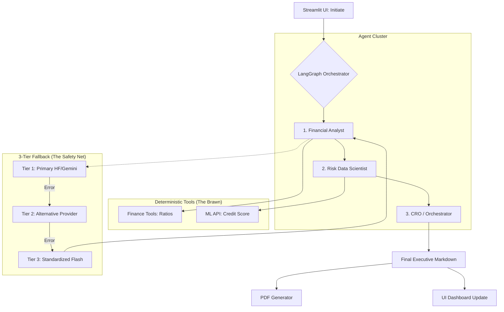

# Agentic Reasoning Engine Report

## 1. Overview
The **Agentic Reasoning Engine** serves as the "Brain" of the ACRAS system. It utilizes **LangChain** and **LangGraph** to orchestrate a sophisticated workflow where multiple specialized Probabilistic Agents (LLMs) collaborate with Deterministic Tools (ML Models, Calculators) to produce a high-confidence credit risk assessment.

## 2. Architecture

### 2.1 The Multi-Tier Fallback Strategy (Resilience First)
To ensure maximum uptime and architectural flexibility, the system employs a **Dynamic 3-Tier Fallback Architecture**. This strategy automatically shifts workloads between providers if an API error (e.g., 404, 429 Rate Limit) is detected.

**Current Model Distribution:**
1.  **Primary Model:** Configurable via `DEFAULT_LLM_PROVIDER`. Default is `HuggingFace` (`Qwen2.5-7B-Instruct`).
2.  **1st Fallback (Cross-Provider):** Automatically switches to the alternative ecosystem. 
    *   If HF fails -> Swaps to `gemini-1.5-flash`.
3.  **2nd Fallback (Stability Pivot):** Uses the standardized `gemini-1.5-flash` for high availability and robust performance.

### 2.2 Live Hot-Swapping (Module Reloading)
A key feature of ACRAS is its ability to swap LLM providers or update model names **without restarting the application**. 

*   **Mechanism:** Inside `src/agents/graph.py`, every agent node executes `importlib.reload(config_module)` and `importlib.reload(prompts_module)` before processing.
*   **Source of Truth:** The system dynamically re-reads `src/agents/config.py`. To enable this live switching, the user should remove the `DEFAULT_LLM_PROVIDER` line from `.env`, allowing the `config.py` file to drive the system state in real-time.

### 2.3 The Multi-Agent Cluster
Unlike a simple LLM wrapper, ACRAS uses a specialized graph of agents:
1.  **Financial Analyst:** Focuses on metric extraction and deterministic ratio calculations.
2.  **Risk Data Scientist:** Interprets ML predictions and provides quantitative reasoning for the Probability of Default (PD).
3.  **CRO (Orchestrator):** Synthesizes all findings into a final executive directive.

### 2.4 Tools as Microservices
To prevent "hallucinations" in critical areas, we wrap external systems and math in typed tools:
*   **`get_credit_risk_score` (`ml_api_tool.py`):** Wraps the FastAPI `/predict` endpoint using shared Pydantic schemas.
*   **Financial Ratios (`finance_tool.py`):** Deterministic Python functions for calculations (Current Ratio, debt-to-equity, etc.).

### 2.5 Workflow Visualization
The following diagram illustrates the granular interaction flow between the agents, the deterministic tools, and the self-healing fallback mechanism:

## 3. Configuration & Security
*   **Settings:** Managed via `src/agents/config.py` using `pydantic-settings`.
*   **Secrets:** API Keys (`GOOGLE_API_KEY`, `HUGGINGFACEHUB_API_TOKEN`) are loaded from `.env`.
*   **UI Sync:** The UI reflects the active provider and model in real-time via the "Active Intelligence" badge.

## 4. Testing & Validation
The agentic layer is tested in `tests/unit/test_agent_tools.py` using `pytest`.
*   **Scenarios:**
    *   **Success:** Valid inputs yield a formatted string with Risk Level and Probability.
    *   **Fallback Logging:** The system logs `🔄 Fallback` events when a higher tier fails, as demonstrated in UI logs.

## 5. Deployment Workflow
1.  **API Backend:** Launch FastAPI (`uvicorn src.app.main:app`).
2.  **UI Frontend:** Launch Streamlit (`streamlit run src/ui/app.py`).
3.  **Dynamic Config:** Edit `src/agents/config.py` and click "Initiate" in the UI to see changes apply instantly.

## 6. How the Configuration works (Pydantic Priority)
Under the hood, we use Pydantic Settings. The loading priority is:
1.  **Environment Variables** (OS level)
2.  **`.env` File Contents**
3.  **Class Defaults** (in `config.py`)

**Strategic Tip:** To fully leverage the **Hot-Swapping** feature, comment out the `DEFAULT_LLM_PROVIDER` in your `.env`. This transfers control to the `config.py` file, which is monitored and reloaded live by the Agent Cluster.
