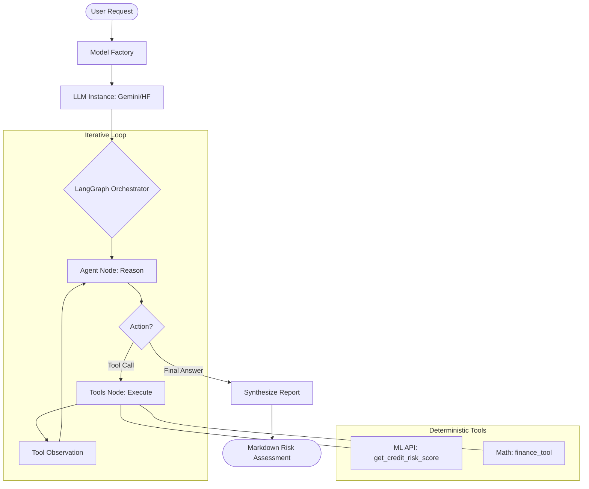

# Agentic Reasoning Engine Report

## 1. Overview
The **Agentic Reasoning Engine** serves as the "Brain" of the ACRAS system. It utilizes **LangChain** and **LangGraph** to orchestrate a sophisticated workflow where a Probabilistic Agent (LLM) delegates specific tasks to Deterministic Tools (ML Models, Calculators) to produce a high-confidence credit risk assessment.

## 2. Architecture

### 2.1 The Multi-Tier Fallback Strategy (Resilience First)
To ensure maximum uptime and architectural flexibility, the system employs a **Dynamic 3-Tier Fallback Architecture**:

1.  **Tier 1: Primary (Provider-Agnostic):** The system uses the `DEFAULT_LLM_PROVIDER` (Gemini or Hugging Face) as the main engine.
2.  **Tier 2: First Fallback (Automatic Swap):** If the primary tier fails (Rate Limits, Model Not Found, Network Error), the graph automatically switches to the *opposite* provider. 
    *   If Primary is HF (Qwen), it falls back to Gemini Power (`gemini-1.5-flash-latest`).
    *   If Primary is Gemini, it falls back to Hugging Face (`Qwen2.5-72B-Instruct`).
3.  **Tier 3: Reliability Safety Net:** As a final layer, the system uses `gemini-flash-lite-latest` due to its high reliability and extremely low latency.

This logic is encapsulated in `src/agents/model_factory.py` (instantiation) and `src/agents/graph.py` (orchestration), ensuring that the agent cluster remains "self-healing" during execution.

### 2.2 The State Graph (LangGraph)
The workflow is defined as a State Graph (`src/agents/graph.py`) with the following nodes:
1.  **Agent Node:** The LLM receives the state (messages) and decides whether to call a tool or providing a final answer.
2.  **Tools Node:** Executes the requested tool (e.g., query the ML API, calculate a ratio) and returns the output to the Agent.

### 2.3 Tools as Microservices
To prevent "hallucinations" in critical areas, we wrap external systems and math in typed tools:
*   **`get_credit_risk_score` (`ml_api_tool.py`):**
    *   **Purpose:** Wraps the FastAPI `/predict` endpoint.
    *   **Safety:** Uses a shared Pydantic schema to ensure the Agent provides all 20 required features. Returns natural language error messages if the API is down.
*   **Financial Ratios (`finance_tool.py`):**
    *   **Purpose:** Deterministic Python functions for calculations (e.g., Debt-to-Equity).
    *   **Safety:** Prevents the LLM from doing arithmetic, which is a known weak point of language models.

### 2.4 Workflow Diagram
The following diagram illustrates the granular interaction flow between the user, the agent, and the deterministic tools:



## 3. Configuration & Security
*   **Settings:** Managed via `src/agents/config.py` using `pydantic-settings`.
*   **Secrets:** API Keys (`GOOGLE_API_KEY`, `HUGGINGFACEHUB_API_TOKEN`) are loaded exclusively from `.env` and never hardcoded.

## 4. Testing & Validation
The agentic layer is tested in `tests/unit/test_agent_tools.py` using `pytest`.
*   **Mocking:** We use `unittest.mock` to simulate the FastAPI response, allowing us to test the Agent's tool logic without needing the actual API server running.
*   **Scenarios:**
    *   **Success:** Valid inputs yield a formatted string with Risk Level and Probability.
    *   **Failure:** Connection errors or invalid inputs are caught and handled gracefully.

## 5. How to Run the Agent
Currently, the agent is orchestrated as a compiled graph. To run the agent in a development environment:

1.  **Environment Setup:** Ensure your `.env` file has a valid `GOOGLE_API_KEY`.
2.  **API Status:** Ensure the ML Model API (FastAPI) is running at `http://localhost:8000`.
3.  **Python Script:** Use the following integration snippet (planned for Phase 5 frontend):

```python
from src.agents.graph import app
from langchain_core.messages import HumanMessage

# Initial State
inputs = {"messages": [HumanMessage(content="Assess the risk for a company with 1M revenue and 200k EBITDA.")]}

# Run the Graph
for output in app.stream(inputs):
    for key, value in output.items():
        print(f"Output from node '{key}':")
        print(value)
```

## 6. Future Roadmap
*   **Integration Tests:** Verify the full `Agent -> Tool -> API` loop in a live environment.
*   **Evaluations:** Implement "LLM-as-a-Judge" using DeepEval to score the quality and faithfulness of the Agent's final reports.

## 7. Configuration
If you change the configuration (e.g. LLM provider) in the `.env` file, you do not need to change the Python code.

### 7.1 How it works (The Pydantic Magic)
Under the hood, we are using a library called Pydantic Settings. Here is the mechanics of why the `.env` takes precedence:

1. **Inheritance:** Our `AgentSettings` class inherits from `BaseSettings`.
2. **The Metadata Layer:** At the bottom of `src/agents/config.py`, you'll see this block:
```python
model_config = SettingsConfigDict(
    env_file=".env", env_file_encoding="utf-8"
)
```

3. **The Priority Chain:** When the application starts and calls `get_agent_settings()`, Pydantic follows a strict priority order to load values:
    *   **Priority 1:** Actual Environment Variables (the most powerful).
    *   **Priority 2:** Values inside the `.env` file.
    *   **Priority 3:** The "Default Value" hardcoded in the Python class.

**In our case**:

- The `DEFAULT_LLM_PROVIDER="gemini"` in the Python file is just a **"Safety Default"** in case the `.env` is missing or the key is deleted.

- Once you add `DEFAULT_LLM_PROVIDER=huggingface` to your `.env`, Pydantic sees it, **"overwrites"** the memory with the value from the file, and that is what the rest of the engine (the agents, the factory) will use.

**Summary**: You can treat the `.env` as your Command Center. Change the provider there, restart the app, and you'll see the change reflected in the terminal banner created in `src\agents\graph.py`.