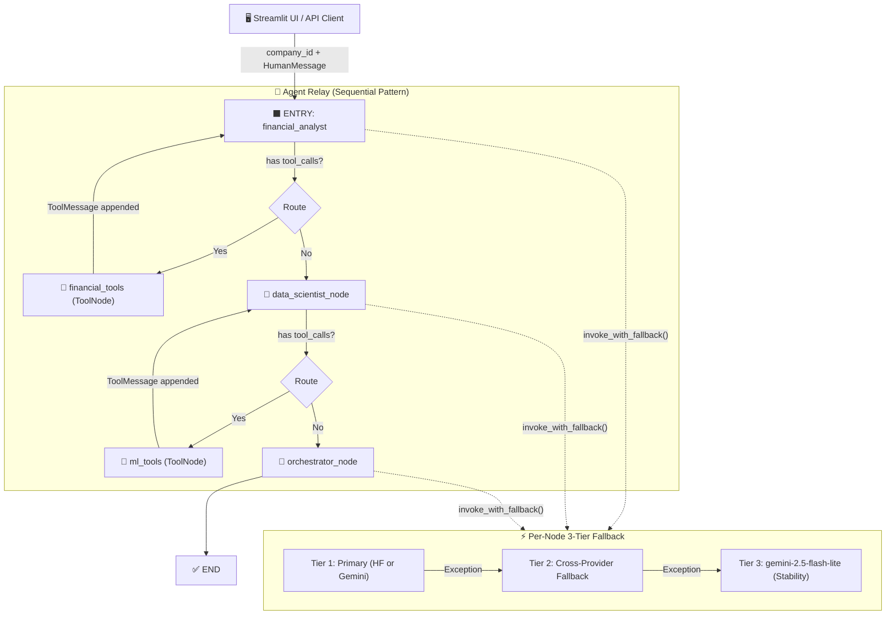

# Agentic Reasoning Engine — Architecture Report

**Project:** Hybrid Agentic ML for Risk Assessment (ACRAS)
**Document Type:** Architecture · The Map
**Version:** 2.0
**Date:** 2026-03-07
**Status:** Production

---

## 1. Executive Summary

The **Agentic Reasoning Engine** (ARE) is the cognitive core of the ACRAS system. It implements a **Sequential Multi-Agent "Relay Team" pattern** using **LangChain** and **LangGraph**, where three specialized agents — a Financial Analyst, a Risk Data Scientist, and an Orchestrating CRO — hand off state to one another in a directed graph.

The Engine separates reasoning from computation: LLM agents act as **the Brain** (probability, synthesis, language generation), while typed deterministic Python tools act as **the Hands** (math, data retrieval, ML API calls). This separation prevents LLM hallucinations in high-stakes financial calculations.

A **3-Tier Dynamic Fallback Strategy** and **Live Hot-Swapping** (via `importlib.reload`) make the engine production-grade: maximally resilient to provider outages and configurable at runtime without any restart.

---

## 2. Module Map

The Engine is implemented within `src/agents/`:

```
src/agents/
├── __init__.py
├── config.py           ← Pydantic Settings: API keys, model names, fallback config
├── graph.py            ← LangGraph StateGraph: Nodes, edges, routing, fallback logic
├── model_factory.py    ← LLM Factory: Gemini & HuggingFace instantiation
├── prompts.py          ← Centralized System Prompts (No Naked Prompts policy)
└── tools/
    ├── __init__.py
    ├── finance_tool.py ← Deterministic financial ratio calculators
    ├── lookup_tool.py  ← Company data fetcher from internal CSV database
    └── ml_api_tool.py  ← HTTP wrapper to the FastAPI ML prediction service
```

---

## 3. Component Architecture

### 3.1 Configuration Layer — `config.py`

All LLM settings are managed via a **Pydantic Settings** class (`AgentSettings`), which loads values from `.env` or OS environment variables. No hardcoded secrets exist in the codebase.

**Loading Priority (Pydantic Settings):**
1. OS-level Environment Variables
2. `.env` File
3. Class Defaults (in `config.py`)

**Key Configuration Parameters:**

| Parameter | Default | Description |
| :--- | :--- | :--- |
| `DEFAULT_LLM_PROVIDER` | `"huggingface"` | Active primary provider: `gemini` or `huggingface` |
| `HF_MODEL` | `Qwen/Qwen2.5-7B-Instruct` | Hugging Face model for Tier 1 (if HF is primary) |
| `GEMINI_POWER_MODEL` | `gemini-2.5-flash` | Gemini model for power tasks (Tier 1/2) |
| `GEMINI_LITE_MODEL` | `gemini-2.5-flash-lite` | Gemini model for stability fallback (Tier 3) |
| `ML_API_URL` | `http://localhost:8000/predict` | URL to the FastAPI Inference Service |

> **Hot-Swap Tip:** To enable live provider switching, remove `DEFAULT_LLM_PROVIDER` from `.env`. Control transfers to `config.py`, which is reloaded on every graph invocation via `importlib.reload(config_module)`.

---

### 3.2 LLM Factory — `model_factory.py`

The `get_llm()` factory abstracts provider-specific initialization. It accepts an optional `provider` and `model_name` override, returning a `BaseChatModel`-compliant object.

**Supported Providers:**

| Provider | LangChain Class | Notes |
| :--- | :--- | :--- |
| `gemini` | `ChatGoogleGenerativeAI` | `temperature=0`, `max_output_tokens=8192` |
| `huggingface` | `ChatHuggingFace(HuggingFaceEndpoint(...))` | `task=text-generation`, `do_sample=False` |

The factory is called via `get_dynamic_models()` in `graph.py`, which **reloads both `config` and `model_factory` modules** before each node execution to pick up live configuration changes.

---

### 3.3 The 3-Tier Fallback System — `get_dynamic_models()` & `invoke_with_fallback()`

This is the resilience backbone of the engine. Every agent node calls `get_dynamic_models()` to receive a fresh, ordered list of three LLM instances before invoking the model.

**Tier Assignment Logic (based on `DEFAULT_LLM_PROVIDER`):**

| Tier | When HF is Primary | When Gemini is Primary |
| :--- | :--- | :--- |
| **Tier 1 (Primary)** | `Qwen2.5-7B-Instruct` (HF) | `gemini-2.5-flash` (Gemini) |
| **Tier 2 (1st Fallback)** | `gemini-2.5-flash` (Cross-provider) | `Qwen2.5-7B-Instruct` (HF) |
| **Tier 3 (2nd Fallback)** | `gemini-2.5-flash-lite` (Stability) | `gemini-2.5-flash-lite` (Stability) |

**`invoke_with_fallback()` Execution Flow:**

1. Tries **Tier 1**. On success, returns response immediately.
2. If Tier 1 raises any `Exception`, logs a `⚠️` warning message to the graph state and tries **Tier 2**.
3. A key optimization: for Tiers 2 and 3, the function **merges the `SystemMessage` into the `HumanMessage`** prompt body. This is required because `ChatHuggingFace` requires strict role-alternation and different models handle system prompts differently.
4. If Tier 2 fails, tries **Tier 3** (always a stable Gemini model).
5. If all three tiers fail, returns a structured `SystemMessage("Error: All tiers failed.")` — allowing the downstream agent or UI to handle the failure gracefully instead of crashing.
6. Gemini's list-format content responses are normalized to plain strings to prevent `operator.add` errors when concatenating messages in graph state.

---

### 3.4 The Agent Cluster — `graph.py` Nodes

The graph consists of five nodes: three agent nodes and two deterministic tool nodes.

#### Agent 1: Financial Analyst (`financial_analyst_node`)

- **Role:** Senior Financial Analyst — data extraction and metric interpretation.
- **Tools bound:** `fetch_company_data`, `calculate_debt_to_equity`, `calculate_ebitda_margin`, `calculate_current_ratio`, `calculate_revenue_growth`.
- **Routing:** If the model returns `tool_calls`, the edge routes to `financial_tools` (a `ToolNode`). After tool execution, the graph loops back to `financial_analyst` to process the result. When no more tool calls are needed, it routes to `data_scientist`.
- **Output Structure:** A structured Markdown report covering Liquidity & Solvency Breakdown, Credit Behavior, Key KPI table, and a Summary Opinion.

#### Agent 2: Risk Data Scientist (`data_scientist_node`)

- **Role:** Lead Data Scientist — quantitative ML-based risk prediction.
- **Tools bound:** `get_credit_risk_score`.
- **Forced Tool Call:** The agent checks the graph state for any prior `get_credit_risk_score` tool message. If none exists, `tool_choice="any"` is set on the model binding, forcing the model to invoke the ML API before generating text.
- **Context Injection:** The `company_id` from the graph state is injected into the system prompt to prevent the agent from hallucinating the company identifier.
- **Routing:** Routes to `ml_tools` if tool calls are present; otherwise routes to `orchestrator`.

#### Agent 3: CRO / Orchestrator (`orchestrator_node`)

- **Role:** Chief Risk Officer — final synthesis into an executive-grade report.
- **Tools bound:** None. This agent receives the full conversation history and synthesizes it.
- **Output Structure:** A complete 6-section Executive Credit Risk Assessment, including a final `SYSTEM FINAL RISK SCORE: [0–100]` that can be parsed by downstream systems (e.g., the PDF generator, Streamlit UI).
- **Terminal Node:** Routes directly to `END`.

---

### 3.5 Deterministic Tools — `src/agents/tools/`

Following Rule 1.2 (Brain vs. Hands), all computation is delegated to deterministic tools. The LLM never performs arithmetic.

#### `lookup_tool.py` — `fetch_company_data`

- **Input:** `company_id: int`
- **Source:** Reads from `artifacts/data_ingestion/val.csv` (the versioned validation dataset).
- **Output:** A string representation of a financial record dict, with `target` and `default_probability` fields excluded to prevent data leakage to the agent.
- **Error Handling:** Returns a descriptive error string if the file is missing or the company ID is not found.

#### `finance_tool.py` — Financial Ratio Calculators

Four deterministic, Pydantic-validated tools that prevent LLM math hallucinations:

| Tool | Formula | Input Schema |
| :--- | :--- | :--- |
| `calculate_debt_to_equity` | `total_liabilities / shareholders_equity` | `DebtToEquityInput` |
| `calculate_ebitda_margin` | `ebitda / revenue` | `EBITDAMarginInput` |
| `calculate_current_ratio` | `current_assets / current_liabilities` | `CurrentRatioInput` |
| `calculate_revenue_growth` | `((current - previous) / previous) * 100` | `RevenueGrowthInput` |

All tools guard against division by zero, returning a descriptive error string.

#### `ml_api_tool.py` — `get_credit_risk_score`

- **Input:** `company_id: int` (validated by `PredictionInput` Pydantic schema)
- **Process:** Reads the company record from `val.csv`, assembles a 20-field structured payload, and POSTs it to the FastAPI service at `ML_API_URL` (`http://localhost:8000/predict`).
- **Output:** `"Risk Level: {risk_level}, Probability of Default: {probability}"`
- **Graceful Degradation:** Returns descriptive error strings on `ConnectionError`, `HTTPError`, or any unexpected exception — allowing the Data Scientist agent to continue with qualitative analysis if the ML service is unavailable.

---

### 3.6 System Prompts — `prompts.py`

Following the **No Naked Prompts policy** (Rule 1.5), all system prompts are centralized in `prompts.py`, completely segregated from the execution logic in `graph.py`. This module is reloaded dynamically on each graph node invocation to support live prompt tuning without restarts.

| Prompt Constant | Agent | Key Constraint |
| :--- | :--- | :--- |
| `FINANCIAL_ANALYST_SYSTEM_PROMPT` | Financial Analyst | Mandates 4-section structured Markdown output with a KPI table |
| `DATA_SCIENTIST_SYSTEM_PROMPT` | Risk Data Scientist | Forces tool call before any analysis text (CRITICAL STEP 1) |
| `ORCHESTRATOR_SYSTEM_PROMPT` | CRO / Orchestrator | Mandates 6-section executive report and a terminal `SYSTEM FINAL RISK SCORE` |

---

## 4. Graph Topology & Execution Flow

### 4.1 LangGraph State

```python
class AgentState(TypedDict):
    messages: Annotated[list[BaseMessage], operator.add]  # Append-only message log
    company_id: str  # Globally available context for all nodes
```

The `operator.add` annotation means each node **appends** its output to the shared message list. This gives every downstream agent access to the full conversation history, serving as the "short-term working memory" for the relay.

### 4.2 Complete Directed Graph



### 4.3 Step-by-Step Execution Narrative

1. **Trigger:** The Streamlit UI or an API caller invokes `app.stream()` with an initial `HumanMessage` (containing the company ID prompt) and the `company_id` in the state.
2. **Financial Analyst Loop:** The agent uses bound financial tools to fetch raw data and compute ratios iteratively. It may call tools multiple times (loop back edge) until all ratios are calculated, then produces its structured Markdown report.
3. **Hand-off to Data Scientist:** The full conversation history (including all tool outputs and the Analyst's report) is passed to the Data Scientist. It is forced to call `get_credit_risk_score` before generating its analysis. It then produces a Quantitative Risk Analysis section.
4. **CRO Synthesis:** The Orchestrator receives the complete message history and generates the final Executive Credit Risk Assessment, including the terminal risk score.
5. **Output Delivery:** The final assistant message is consumed by the UI for rendering and/or by the PDF generator.

---

## 5. LLM Provider Decision Matrix

The choice of LLM per role is deliberately strategic. See `decisions/gemini_model_assessment.md` and `decisions/hf_assessment.md` for full rationale.

| Agent Role | Preferred Model | Reasoning |
| :--- | :--- | :--- |
| **Financial Analyst** | `gemini-2.5-flash` | High context window for large financial records; cost-efficient for text processing |
| **Risk Data Scientist** | `Qwen2.5-7B-Instruct` (HF) | Exceptional strict JSON/tool-calling; no hallucination on `PredictionInput` schema |
| **CRO / Orchestrator** | `gemini-2.5-flash` | Strong synthesis and report generation; handles long conversation histories |

---

## 6. Deployment Requirements

**Runtime Services (must be running simultaneously):**

| Service | Launch Command | Default Port |
| :--- | :--- | :--- |
| FastAPI ML Inference | `uvicorn src.app.main:app` | `8000` |
| Streamlit UI | `streamlit run src/ui/app.py` | `8501` |

**Environment Variables (`.env`):**

```dotenv
GOOGLE_API_KEY=your_google_api_key
HUGGINGFACEHUB_API_TOKEN=your_hf_token
DEFAULT_LLM_PROVIDER=huggingface   # or "gemini"; omit for live hot-swapping
```

---

## 7. Testing & Observability

- **Unit Tests:** `tests/unit/test_agent_tools.py` — validates tool determinism (success and failure paths) using `pytest`.
- **Fallback Validation:** Tier switches are logged as `🔄 Fallback` events appended to the `AgentState.messages` list, surfaced in the Streamlit UI log panel.
- **Agentic Evals:** Agent quality is assessed via LLM-as-a-Judge scoring on "Relevance," "Tool Usage Accuracy," "Schema Adherence," and "Business Value Alignment."
- **Tracing:** All node invocations should be instrumented with LangSmith or an OpenTelemetry-compatible tracer for Chain-of-Thought visibility and token usage tracking.

---

## 8. Key Design Decisions (ADR Summary)

| Decision | Choice | Rationale |
| :--- | :--- | :--- |
| Graph framework | LangGraph `StateGraph` | Provides controllable deterministic routing; avoids LLM-directed tool loops |
| Agent pattern | Sequential Relay (not parallel) | Risk scoring requires ordered context accumulation; Analyst findings feed the Scientist |
| Tool execution | `ToolNode` (pre-built) | Standard LangGraph pattern; cleanly maps `tool_calls` to `ToolMessage` objects |
| Fallback strategy | `importlib.reload` per node | Enables hot-swapping without restart; state is always based on current config |
| Math delegation | Pydantic-validated deterministic tools | Eliminates LLM hallucinations on financial ratios per Rule 1.2 |
| Prompt management | Centralized `prompts.py` + dynamic reload | Supports live prompt tuning (Rule 1.5, No Naked Prompts) |
| Data leakage prevention | `target`/`default_probability` excluded in lookup tool | Prevents agent from seeing ground truth label during inference |
