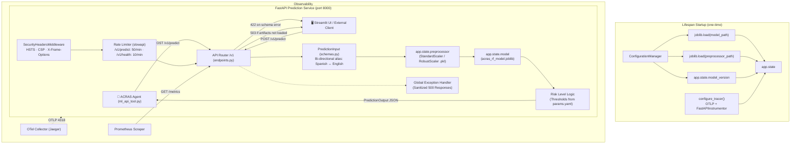

# API Prediction Service — Architecture Report

**Project:** Hybrid Agentic ML for Risk Assessment (ACRAS)
**Document Type:** Architecture · The Map
**Version:** 3.0
**Date:** 2026-05-08
**Status:** Production (Elite Infrastructure)

---

## 1. Purpose

The **ACRAS Prediction Service** exposes the trained Random Forest credit risk model as a RESTful API. It acts as the deterministic "Hand" that the Agentic Reasoning Engine's `get_credit_risk_score` tool calls via HTTP to obtain quantitative risk assessments. No business logic or inference is performed by the Agent itself — all computation is delegated here.

---

## 2. Architecture Overview

The service is built on **FastAPI** for high-performance async request handling, **Prometheus** for operational observability, and **OpenTelemetry** for distributed tracing. Artifacts are loaded once at startup via an async lifespan context manager, not per-request. All routes are versioned under `/v1/`.



---

## 3. Module Map

```
src/app/
├── main.py          ← FastAPI app factory, lifespan, OTel + Prometheus setup
├── schemas.py       ← Pydantic data contracts (PredictionInput, PredictionOutput)
├── core/
│   ├── __init__.py  ← Core package marker
│   └── security.py  ← SecurityHeadersMiddleware + slowapi Limiter
└── api/
    ├── __init__.py  ← Exposes api_router
    └── endpoints.py ← Route definitions: /v1/health, /v1/predict (rate-limited)
```

---

## 4. Key Components

### 4.1 Lifespan Management — `main.py`

The application uses `@asynccontextmanager` for artifact loading. This ensures:
- The model and preprocessor are loaded **exactly once** at startup, not per-request.
- Artifact paths are resolved through `ConfigurationManager`, which reads `config/config.yaml` — the single source of truth for paths.
- If artifacts are missing at startup, the application **raises immediately (Fail Fast)** rather than serving partial requests.
- `configure_tracer()` is called during startup to bootstrap the OpenTelemetry `TracerProvider` and `FastAPIInstrumentor`.
- `app.state.model_version` is set from `ConfigurationManager` and surfaced in the `/v1/health` response.

```python
# Artifacts are accessed during inference via:
model        = request.app.state.model
preprocessor = request.app.state.preprocessor
model_version = request.app.state.model_version   # exposed in /v1/health
```

### 4.2 Data Contracts — `schemas.py`

The `PredictionInput` schema uses **Pydantic aliases** to accept both English (agent-friendly) and Spanish (internal column name) field names. This is enabled via `ConfigDict(populate_by_name=True)`.

**20-Field Input Schema (`PredictionInput`):**

| English Alias (Agent sends) | Internal Field (Spanish) | Type | Description |
| :--- | :--- | :--- | :--- |
| `annual_revenue` | `ingresos` | `float` | Annual Revenue |
| `ebitda` | `ebitda` | `float` | EBITDA |
| `total_assets` | `activos_totales` | `float` | Total Assets |
| `total_liabilities` | `pasivos_totales` | `float` | Total Liabilities |
| `total_equity` | `patrimonio` | `float` | Total Equity |
| `cash` | `caja` | `float` | Cash and Equivalents |
| `interest_expenses` | `gastos_intereses` | `float` | Interest Expenses |
| `accounts_receivable` | `cuentas_cobrar` | `float` | Accounts Receivable |
| `inventory` | `inventario` | `float` | Inventory |
| `accounts_payable` | `cuentas_pagar` | `float` | Accounts Payable |
| `sector_risk_score` | `sector_risk_score` | `float` | Sector-specific risk score |
| `years_operating` | `years_operating` | `int` | Years in operation |
| `delinquency_ratio` | `ratio_mora` | `float` | Delinquency ratio |
| `credit_utilization` | `ratio_utilizacion` | `float` | Credit utilization |
| `revenue_growth` | `revenue_growth` | `float` | YoY revenue growth |
| `profit_margin` | `margen_beneficio` | `float` | Profit margin |
| `bureau_score` | `score_buro` | `float` | Bureau credit score |
| `ebitda_margin` | `ebitda_margin` | `float` | EBITDA / Revenue |
| `debt_to_equity` | `debt_to_equity` | `float` | Total Liabilities / Total Equity |
| `current_ratio` | `current_ratio` | `float` | Current Assets / Current Liabilities |

**3-Field Output Schema (`PredictionOutput`):**

| Field | Type | Description |
| :--- | :--- | :--- |
| `prediction` | `int` | Predicted class: `0` (Non-Default) or `1` (Default) |
| `probability` | `float` | Probability of Default (`0.0` to `1.0`) |
| `risk_level` | `str` | Interpreted risk: `Low`, `Medium`, or `High` |

### 4.3 Risk Level Thresholds (v2.0)

Risk levels are no longer hardcoded. They are determined by deterministic thresholds defined in `config/params.yaml` (e.g., `risk_thresholds.low_limit`), injected via `ConfigurationManager`.

| Probability of Default (PD) | Risk Level | Config Source |
| :--- | :--- | :--- |
| `PD < low_limit` | `Low` | `params.yaml` |
| `low_limit ≤ PD < high_limit` | `Medium` | `params.yaml` |
| `PD ≥ high_limit` | `High` | `params.yaml` |

This decoupling allows risk policy changes to be applied instantly across both the Training/Evaluation pipeline and the Live API without code changes.

### 4.4 Inference Pipeline (per-request)

1. `PredictionInput` is validated by Pydantic. On failure → `422 Unprocessable Entity`.
2. Input is converted to a Pandas `DataFrame` via `model_dump()`.
3. `preprocessor.transform(input_df)` applies the fitted scaler loaded at startup.
4. `model.predict()` and `model.predict_proba()` are called on the transformed array.
5. The risk level is computed from the probability with the threshold logic above.
6. A `PredictionOutput` JSON response is returned.

### 4.5 Observability (v3.0)

- **Prometheus Instrumentator**: Automatically exposes request latency, request count, and error rate at `/metrics` via `prometheus_fastapi_instrumentator`.
- **Health Check `/v1/health`**: Verifies that `app.state.model` and `app.state.preprocessor` are both loaded. Returns `503` if not ready — compatible with Kubernetes/Docker liveness probes. Now includes `model_version` in the response body for traceability.
- **OpenTelemetry Tracing**: `FastAPIInstrumentor.instrument_app(app)` auto-instruments all routes with OTLP-compatible spans (`http.method`, `http.url`, `http.status_code`, `http.route`). See `reports/docs/architecture/observability_tracing.md` for full span hierarchy.

### 4.6 Security Middleware (v3.0)

All requests pass through two global security layers before reaching any endpoint handler:

| Layer | Implementation | Purpose |
| :--- | :--- | :--- |
| **SecurityHeadersMiddleware** | `src/app/core/security.py` | Injects HSTS, CSP, `X-Content-Type-Options`, `X-Frame-Options`, `X-XSS-Protection` on every response |
| **Rate Limiter** | `slowapi` (`src/app/core/security.py`) | `/v1/health`: 10 req/min · `/v1/predict`: 50 req/min · Global: 100 req/min |

---

## 5. Endpoints Reference

| Method | Path | Description | Input | Success | Error |
| :--- | :--- | :--- | :--- | :--- | :--- |
| `GET` | `/v1/health` | Service liveness check | None | `200 {"status": "ok", "model_version": "..."}` | `503` if artifacts missing |
| `POST` | `/v1/predict` | Credit risk prediction | `PredictionInput` JSON | `200 PredictionOutput` | `422` (Schema), `500` (Sanitized) |
| `GET` | `/metrics` | Prometheus metrics scrape | None | Text format | — |

---

## 6. Running Locally

```bash
# Option 1: Module mode (production-like, no auto-reload)
uv run python -m src.app.main

# Option 2: Uvicorn with auto-reload (development)
uv run uvicorn src.app.main:app --host 0.0.0.0 --port 8000 --reload
```

> **Prerequisite:** The DVC pipeline (`uv run dvc repro`) must have been run at least once so that `artifacts/model_trainer/acras_rf_model.joblib` and `artifacts/data_transformation/preprocessor.pkl` exist.

---

## 7. Docker & Containerization

### 7.1 Production-Ready Dockerfile
The service uses a **multi-stage build** to keep the final runtime image lean and secure, adhering to 2026-grade production hygiene.

| Stage | Base Image | Purpose |
| :--- | :--- | :--- |
| `builder` | `ghcr.io/astral-sh/uv:python3.10-bookworm-slim` | Installs dependencies into `.venv` using `uv` with lockfile integrity |
| `runtime` | `python:3.10-slim-bookworm` | Copies `.venv` + source only — pinned for supply chain security |

**Security & Performance Features:**
- **Layer Caching:** Dependency manifests (`pyproject.toml`, `uv.lock`) are cached separately from code.
- **Least Privilege:** Runs as `appuser` with a dedicated group; uses `COPY --chown` to avoid layer bloat.
- **Fail-Fast HEALTHCHECK:** Native liveness probe integrated into the engine.

### 7.2 Development Workflow (No Rebuilds)
For rapid local iteration, use **Docker Compose**. This maps your local directories into the container using **bind mounts**, allowing code changes to take effect instantly via Uvicorn's `--reload` flag without rebuilding the image.

```yaml
# Summary of docker-compose.yaml mappings:
# ./src       -> /app/src       (Instant code updates)
# ./config    -> /app/config    (Configuration live-updates)
# ./artifacts -> /app/artifacts (Update models without rebuild)
# ./logs      -> /app/logs      (Persistence: logs stay on host)
```

**Commands for Rapid Development:**

```bash
# 1. Start the service with live-reload (recommended)
docker-compose up --build -d

# 2. View streaming logs
docker-compose logs -f

# 3. Stop the service
docker-compose down
```

> **Note:** Use `docker-compose up --build` only if you change `pyproject.toml` or the `Dockerfile` structure itself. For regular `src/` changes, the container updates automatically.

### 7.3 Manual Docker Commands (CI/CD / Production)
Use these for building static, immutable images for deployment:

```bash
# Build a production-ready image
docker build -t acras-prediction-service:v2 .

# Run manually (standalone)
docker run --name acras-api -p 8000:8000 acras-prediction-service:v2
```

---

## 8. Launching the Full System (Backend + UI)

The full ACRAS application consists of the predictive backend API and the interactive Streamlit dashboard.

### Option A: Hybrid Launch (Recommended)
This workflow isolates the backend inside a hot-reloading Docker container while allowing you to run the UI locally.

1. **Start the API Backend via Docker Compose:**
   ```bash
   docker-compose up -d
   ```
2. **Launch the Streamlit UI locally (in a new terminal):**
   ```bash
   uv run streamlit run src/ui/app.py
   ```
   > The UI will automatically route internal `/predict` calls to the containerized API running on `http://localhost:8000`.

### Option B: Fully Local Launch
If you want to run both components natively without Docker:

1. **Start the API Backend locally:**
   ```bash
   uv run uvicorn src.app.main:app --host 0.0.0.0 --port 8000 --reload
   ```
2. **Launch the Streamlit UI locally (in a new terminal):**
   ```bash
   uv run streamlit run src/ui/app.py
   ```

---

## 9. API Usage Examples

### Health Check
```bash
curl -X GET http://localhost:8000/v1/health
```
```json
{"status": "ok", "service": "ACRAS-API", "model_version": "acras_rf_model_v1.0"}
```

### Prediction (using English aliases — as the Agent sends it)
```bash
curl -X POST http://localhost:8000/v1/predict \
  -H "Content-Type: application/json" \
  -d '{
    "annual_revenue": 5000000,
    "ebitda": 1000000,
    "total_assets": 2000000,
    "total_liabilities": 800000,
    "total_equity": 1200000,
    "cash": 200000,
    "interest_expenses": 50000,
    "accounts_receivable": 150000,
    "inventory": 100000,
    "accounts_payable": 80000,
    "sector_risk_score": 3.5,
    "years_operating": 5,
    "delinquency_ratio": 0.02,
    "credit_utilization": 0.4,
    "revenue_growth": 0.1,
    "profit_margin": 0.2,
    "bureau_score": 750,
    "ebitda_margin": 0.2,
    "debt_to_equity": 0.66,
    "current_ratio": 2.0
  }'
```
```json
{
  "prediction": 0,
  "probability": 0.19,
  "risk_level": "Low"
}
```

> **Note:** The schema also accepts the **Spanish internal column names** directly (e.g., `ingresos`, `patrimonio`), since `populate_by_name=True` is set on the schema config.

---

## 10. Error Reference

| HTTP Code | Cause | Resolution |
| :--- | :--- | :--- |
| `503 Service Unavailable` | Model/preprocessor artifacts not loaded at startup | Run DVC pipeline first; check artifact paths in `config.yaml` |
| `422 Unprocessable Entity` | Input schema validation failed | Verify all 20 fields are present and correctly typed |
| `500 Internal Server Error` | Unexpected runtime exception (Sanitized v2.0) | Checked in structured logs; response hides internal traceback for security |
