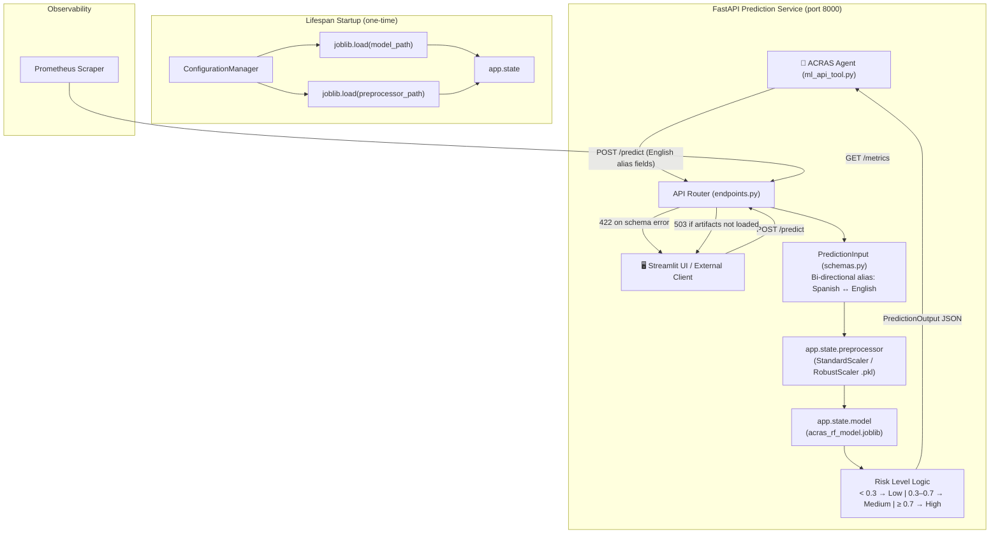

# API Prediction Service — Architecture Report

**Project:** Hybrid Agentic ML for Risk Assessment (ACRAS)
**Document Type:** Architecture · The Map
**Version:** 2.0
**Date:** 2026-03-07
**Status:** Production

---

## 1. Purpose

The **ACRAS Prediction Service** exposes the trained Random Forest credit risk model as a RESTful API. It acts as the deterministic "Hand" that the Agentic Reasoning Engine's `get_credit_risk_score` tool calls via HTTP to obtain quantitative risk assessments. No business logic or inference is performed by the Agent itself — all computation is delegated here.

---

## 2. Architecture Overview

The service is built on **FastAPI** for high-performance async request handling and **Prometheus** for operational observability. Artifacts are loaded once at startup via an async lifespan context manager, not per-request.



---

## 3. Module Map

```
src/app/
├── main.py          ← FastAPI app factory, lifespan, Prometheus setup
├── schemas.py       ← Pydantic data contracts (PredictionInput, PredictionOutput)
└── api/
    ├── __init__.py  ← Exposes api_router
    └── endpoints.py ← Route definitions: /health, /predict
```

---

## 4. Key Components

### 4.1 Lifespan Management — `main.py`

The application uses `@asynccontextmanager` for artifact loading. This ensures:
- The model and preprocessor are loaded **exactly once** at startup, not per-request.
- Artifact paths are resolved through `ConfigurationManager`, which reads `config/config.yaml` — the single source of truth for paths.
- If artifacts are missing at startup, the application **raises immediately (Fail Fast)** rather than serving partial requests.

```python
# Artifacts are accessed during inference via:
model      = request.app.state.model
preprocessor = request.app.state.preprocessor
```

### 4.2 Data Contracts — `schemas.py`

The `PredictionInput` schema uses **Pydantic aliases** to accept both English (agent-friendly) and Spanish (internal column name) field names. This is enabled via `ConfigDict(populate_by_name=True)`.

**20-Field Input Schema (`PredictionInput`):**

| English Alias (Agent sends) | Internal Field (Spanish) | Type | Description |
| :--- | :--- | :--- | :--- |
| `annual_revenue` | `ingresos` | `float` | Annual Revenue |
| `ebitda` | `ebitda` | `float` | EBITDA |
| `total_assets` | `activos_totales` | `float` | Total Assets |
| `total_liabilities` | `pasivos_totales` | `float` | Total Liabilities |
| `total_equity` | `patrimonio` | `float` | Total Equity |
| `cash` | `caja` | `float` | Cash and Equivalents |
| `interest_expenses` | `gastos_intereses` | `float` | Interest Expenses |
| `accounts_receivable` | `cuentas_cobrar` | `float` | Accounts Receivable |
| `inventory` | `inventario` | `float` | Inventory |
| `accounts_payable` | `cuentas_pagar` | `float` | Accounts Payable |
| `sector_risk_score` | `sector_risk_score` | `float` | Sector-specific risk score |
| `years_operating` | `years_operating` | `int` | Years in operation |
| `delinquency_ratio` | `ratio_mora` | `float` | Delinquency ratio |
| `credit_utilization` | `ratio_utilizacion` | `float` | Credit utilization |
| `revenue_growth` | `revenue_growth` | `float` | YoY revenue growth |
| `profit_margin` | `margen_beneficio` | `float` | Profit margin |
| `bureau_score` | `score_buro` | `float` | Bureau credit score |
| `ebitda_margin` | `ebitda_margin` | `float` | EBITDA / Revenue |
| `debt_to_equity` | `debt_to_equity` | `float` | Total Liabilities / Total Equity |
| `current_ratio` | `current_ratio` | `float` | Current Assets / Current Liabilities |

**3-Field Output Schema (`PredictionOutput`):**

| Field | Type | Description |
| :--- | :--- | :--- |
| `prediction` | `int` | Predicted class: `0` (Non-Default) or `1` (Default) |
| `probability` | `float` | Probability of Default (`0.0` to `1.0`) |
| `risk_level` | `str` | Interpreted risk: `Low`, `Medium`, or `High` |

### 4.3 Risk Level Thresholds — `endpoints.py`

The `risk_level` field is determined by the following deterministic thresholds applied to the raw probability output:

| Probability of Default | Risk Level |
| :--- | :--- |
| `PD < 0.30` | `Low` |
| `0.30 ≤ PD < 0.70` | `Medium` |
| `PD ≥ 0.70` | `High` |

### 4.4 Inference Pipeline (per-request)

1. `PredictionInput` is validated by Pydantic. On failure → `422 Unprocessable Entity`.
2. Input is converted to a Pandas `DataFrame` via `model_dump()`.
3. `preprocessor.transform(input_df)` applies the fitted scaler loaded at startup.
4. `model.predict()` and `model.predict_proba()` are called on the transformed array.
5. The risk level is computed from the probability with the threshold logic above.
6. A `PredictionOutput` JSON response is returned.

### 4.5 Observability

- **Prometheus Instrumentator**: Automatically exposes request latency, request count, and error rate at `/metrics` via `prometheus_fastapi_instrumentator`.
- **Health Check `/health`**: Verifies that `app.state.model` and `app.state.preprocessor` are both loaded. Returns `503` if not ready — compatible with Kubernetes/Docker liveness probes.

---

## 5. Endpoints Reference

| Method | Path | Description | Input | Success | Error |
| :--- | :--- | :--- | :--- | :--- | :--- |
| `GET` | `/health` | Service liveness check | None | `200 {"status": "ok", "service": "ACRAS-API"}` | `503` if artifacts missing |
| `POST` | `/predict` | Credit risk prediction | `PredictionInput` JSON | `200 PredictionOutput` JSON | `422` on schema/inference error, `503` if not initialized |
| `GET` | `/metrics` | Prometheus metrics scrape | None | Prometheus text format | — |

---

## 6. Running Locally

```bash
# Option 1: Module mode (production-like, no auto-reload)
uv run python -m src.app.main

# Option 2: Uvicorn with auto-reload (development)
uv run uvicorn src.app.main:app --host 0.0.0.0 --port 8000 --reload
```

> **Prerequisite:** The DVC pipeline (`uv run dvc repro`) must have been run at least once so that `artifacts/model_trainer/acras_rf_model.joblib` and `artifacts/data_transformation/preprocessor.pkl` exist.

---

## 7. Docker Integration

The service uses a **multi-stage build** to keep the final runtime image lean and secure.

| Stage | Base Image | Purpose |
| :--- | :--- | :--- |
| `builder` | `ghcr.io/astral-sh/uv:python3.10-bookworm-slim` | Installs all dependencies into `.venv` using `uv` |
| `runtime` | `python:3.10-slim` | Copies `.venv` + source only — no build tools |

**Key features of the updated `Dockerfile`:**
- **`uv sync --no-dev`** replaces `pip install` for fast, reproducible installs.
- **Layer caching:** `pyproject.toml` is copied first and `uv sync` runs before `COPY src/` — dependency installation is only re-run when `pyproject.toml` changes.
- **Non-root user:** Runs as `appuser` for security hardening.
- **Explicit artifact `COPY`:** The three required runtime artifacts are copied individually, not via a broad `COPY . /app`:
  - `artifacts/model_trainer/acras_rf_model.joblib`
  - `artifacts/data_transformation/preprocessor.pkl`
  - `artifacts/data_ingestion/val.csv` (required by the agent's `lookup_tool`)
- **`HEALTHCHECK`:** Docker / Kubernetes-native liveness check against `/health`.
- **2 workers:** `--workers 2` for modest concurrency on a single container.

> **Prerequisite:** Run `uv run dvc repro` before building to ensure all three artifact files exist locally.

```bash
# Build the image
docker build -t acras-prediction-service:v2 .

# Run the container
docker run -p 8000:8000 acras-prediction-service:v2

# Verify non-root user
docker run --rm acras-prediction-service:v2 whoami  # → appuser

# Stop and remove
docker stop acras-prediction-service:v2
docker rm acras-prediction-service:v2
```

---

## 8. API Usage Examples

### Health Check
```bash
curl -X GET http://localhost:8000/health
```
```json
{"status": "ok", "service": "ACRAS-API"}
```

### Prediction (using English aliases — as the Agent sends it)
```bash
curl -X POST http://localhost:8000/predict \
  -H "Content-Type: application/json" \
  -d '{
    "annual_revenue": 5000000,
    "ebitda": 1000000,
    "total_assets": 2000000,
    "total_liabilities": 800000,
    "total_equity": 1200000,
    "cash": 200000,
    "interest_expenses": 50000,
    "accounts_receivable": 150000,
    "inventory": 100000,
    "accounts_payable": 80000,
    "sector_risk_score": 3.5,
    "years_operating": 5,
    "delinquency_ratio": 0.02,
    "credit_utilization": 0.4,
    "revenue_growth": 0.1,
    "profit_margin": 0.2,
    "bureau_score": 750,
    "ebitda_margin": 0.2,
    "debt_to_equity": 0.66,
    "current_ratio": 2.0
  }'
```
```json
{
  "prediction": 0,
  "probability": 0.19,
  "risk_level": "Low"
}
```

> **Note:** The schema also accepts the **Spanish internal column names** directly (e.g., `ingresos`, `patrimonio`), since `populate_by_name=True` is set on the schema config.

---

## 9. Error Reference

| HTTP Code | Cause | Resolution |
| :--- | :--- | :--- |
| `503 Service Unavailable` | Model/preprocessor artifacts not loaded at startup | Run DVC pipeline first; check artifact paths in `config.yaml` |
| `422 Unprocessable Entity` | Input schema validation failed or inference raised an exception | Verify all 20 fields are present and correctly typed |
