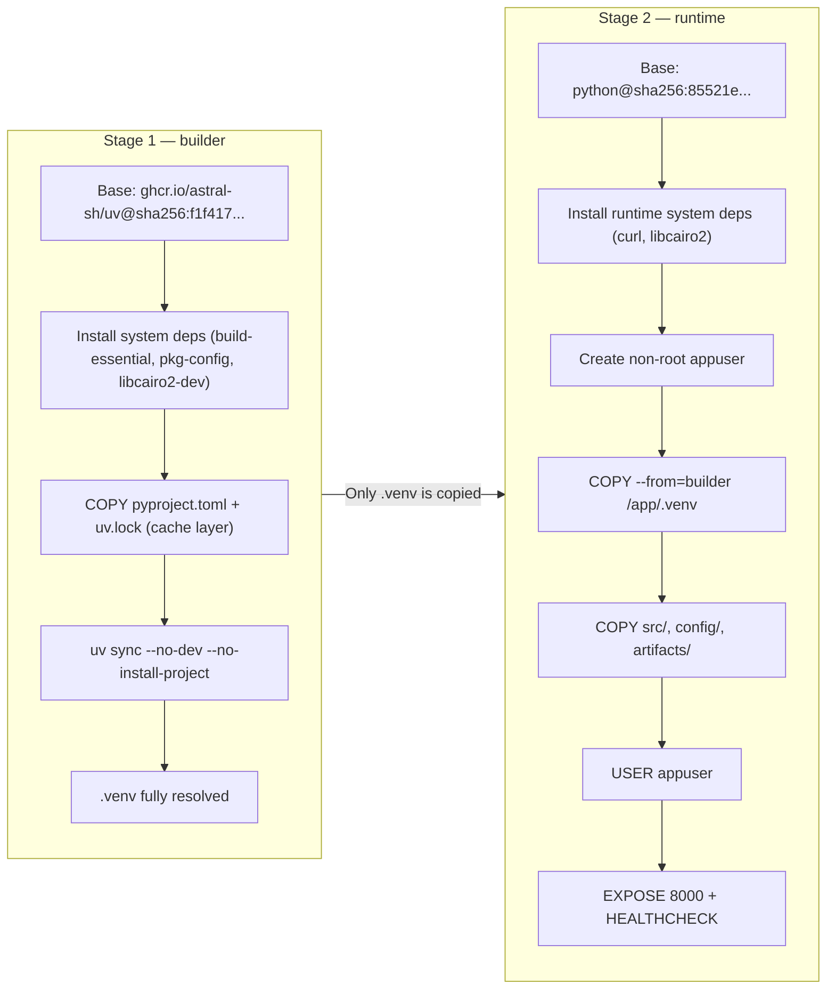

# Containerization Report — ACRAS Prediction Service

**Project:** Hybrid Agentic ML for Risk Assessment (ACRAS)
**Document Type:** Architecture · The Map
**Version:** 1.0
**Date:** 2026-03-08
**Status:** Active

---

## 1. Overview

This report documents the containerization strategy for the ACRAS FastAPI Prediction Service. The goal was to package the ML inference service into a reproducible, secure, and production-grade container image, and to integrate Docker build validation into the CI pipeline.

The implementation follows a **multi-stage Dockerfile pattern** for a minimal runtime image, a **Docker Compose** setup for rapid local development without rebuilds, and a **CI smoke test** that validates the build on every relevant code change.

> **No Registry Push:** Since ACRAS is a portfolio project, the Docker image is built locally and by CI for validation purposes only — it is **not pushed to any container registry**. Adding a push to **Docker Hub** or **GitHub Container Registry (GHCR)** would be a straightforward extension when moving to a production deployment.

---

## 2. Dockerfile Architecture — Multi-Stage Build

The `Dockerfile` uses a two-stage build to decouple the **dependency resolution environment** from the **lean runtime environment**. This is the standard pattern for production Python ML services.



### Why Two Stages?

| Concern | Stage 1 (Builder) | Stage 2 (Runtime) |
| :--- | :--- | :--- |
| **Base Image** | Full uv image with build tools | Slim Python image — no compilers |
| **System Packages** | `build-essential`, `pkg-config`, `libcairo2-dev` | `curl`, `libcairo2` only |
| **What Gets Copied** | Entire system + build artifacts | `.venv`, `src/`, `config/`, `artifacts/` |
| **Final Image Size** | Large (discarded) | Minimal — no build-time residue |

This pattern ensures the final image contains **no compiler toolchains, no build headers, no uv binary** — just the resolved virtual environment and the application source.

---

## 3. Security Design

| Practice | Implementation |
| :--- | :--- |
| **Non-root user** | `groupadd appuser` + `useradd appuser`; container runs as `appuser` |
| **COPY --chown** | Avoids creating extra intermediate layers for ownership changes |
| **Pinned base images** | Base images are pinned by **SHA256 digest** for immutability |
| **Minimal system packages** | Runtime stage only installs `curl` and `libcairo2` |
| **No secrets in image** | No `.env` files, API keys, or credentials baked into the image |
| **Non-writable root** | Application files owned by `appuser`; process runs with least privilege |

### Why Pinned Digests?

Using immutable **SHA256 digests** (for Docker images) and **Full Commit SHAs** (for GitHub Actions) is a critical practice for "Elite" production systems. It moves your infrastructure from "probable" to **"provable"** security.

#### **1. Protection Against "Tag Drifting"**
Tags like `:latest`, `:3.10-slim`, or `@v5` are **mutable**. 
*   **The Risk**: A maintainer can update the image or action behind a tag at any time. If they push a version with a bug or a breaking change, your pipeline will suddenly fail without you having changed a single line of your own code.
*   **The SHA Solution**: A SHA256 digest is a cryptographic hash of the content itself. If even one byte of the image changes, the SHA changes. Pinning to a SHA ensures you get the **exact same bits** every single time, forever.

#### **2. Supply Chain Security (Anti-Hijacking)**
This is the most critical reason for modern MLOps.
*   **The Risk**: If a developer's account for a popular GitHub Action or Docker image is compromised, an attacker can push a "malicious" version of the software under the same version tag (e.g., hijacking `@v5` to include a credential-stealer).
*   **The SHA Solution**: An attacker cannot forge a SHA256 digest that matches the original content. By pinning to a SHA, you ensure that even if the tag is hijacked, your pipeline will either continue using the original safe version or fail to find a match—preventing the execution of malicious code in your environment.

#### **3. Absolute Reproducibility**
In Machine Learning, reproducibility is everything.
*   **The Risk**: You train a model today on a specific base image. Six months later, you try to retrain it, but the `:3.10-slim` image has been updated with a different version of a low-level C library that slightly alters how math is calculated. Your model's performance drifts, and you can't figure out why.
*   **The SHA Solution**: Pinning the base image digest ensures that the environment used for training and inference is **byte-for-byte identical** across years and environments.

#### **4. Faster Audits & Compliance**
For regulated industries (like the Credit Risk sector ACRAS addresses), auditors require proof of what was running. 
*   **Proving State**: "We were running `python:3.10`" is vague. 
*   **Elite State**: "We were running image `sha256:85521e102...`" is a cryptographically verifiable fact that satisfies the highest levels of governance (SOC2, ISO 27001).

### **Summary Comparison**

| Feature | Version Tags (`:latest`, `@v5`) | Immutable SHAs (`@sha256:...`) |
| :--- | :--- | :--- |
| **Reliability** | ⚠️ Can break overnight | ✅ Guaranteed stable |
| **Security** | ⚠️ Vulnerable to hijacking | ✅ Cryptographically secure |
| **Reproducibility** | ⚠️ Approximate | ✅ Absolute |
| **Maturity** | Basic / Development | **Elite / Production** |

---

## 4. Layer Cache Optimization

The Dockerfile is structured to maximize Docker's build layer cache — the most expensive operation is dependency resolution, which only re-runs if `pyproject.toml` or `uv.lock` changes:

```dockerfile
# --- Layer cache optimization ---
# Copy ONLY the dependency manifests first.
# This layer is cached and skipped on rebuilds
# as long as pyproject.toml and uv.lock have not changed.
COPY pyproject.toml uv.lock ./
RUN uv sync --no-dev --no-install-project

# Source code changes (src/, config/) only invalidate layers below.
COPY --chown=appuser:appuser src/ ./src/
```

**Consequence:** Editing a line in `src/app/api/endpoints.py` only invalidates the `COPY src/` layer. The costly `uv sync` (resolving ~300 packages) is served entirely from cache.

---

## 5. ML Artifact Handling

The model artifacts are **not baked into the image at build time** beyond the local `docker build` workflow. They are managed as a separate concern:

| Artifact | Source | Size |
| :--- | :--- | :--- |
| `artifacts/model_trainer/acras_rf_model.joblib` | DVC pipeline output | ~10 MB |
| `artifacts/data_transformation/preprocessor.pkl` | DVC pipeline output | ~5 KB |
| `artifacts/data_ingestion/val.csv` | DVC pipeline output | ~100 KB |

**Production patterns to consider:**
- **Bind-mount at runtime:** Mount artifacts from the host (used in `docker-compose.yaml` development mode).
- **Object Storage at startup:** Pull from S3/GCS on container start using an entrypoint script (ideal for cloud deployments).
- **Bake into image:** Only appropriate if artifacts are small and the registry is private (current local `docker build` approach).

> **DVC Prerequisite:** Artifacts must exist locally before running `docker build`. They are produced by `uv run dvc repro`.

---

## 6. Docker Compose — Local Development Mode

The `docker-compose.yaml` is configured specifically for **rapid inner-loop development**. It overrides the production `ENTRYPOINT`/`CMD` pair with Uvicorn's `--reload` flag and mounts local directories as **bind mounts**:

```yaml
volumes:
  - ./src:/app/src          # Instant code updates — no rebuild needed
  - ./config:/app/config    # Configuration live-updates
  - ./artifacts:/app/artifacts  # Swap models without rebuild
  - ./logs:/app/logs        # Logs persist on the host filesystem
```

### Development Commands

```bash
# Start the service with hot-reload (first time or after Dockerfile changes)
docker-compose up --build -d

# Start without rebuild (code is live-mounted)
docker-compose up -d

# Stream logs in real-time
docker-compose logs -f

# Stop and remove containers
docker-compose down
```

> **Rule of thumb:** Only use `--build` when `pyproject.toml`, `uv.lock`, or the `Dockerfile` itself changes. For all `src/` edits, Uvicorn's `--reload` picks up changes automatically via the bind mount.

---

## 7. Health Check

A native Docker health check is embedded in the `Dockerfile`, compatible with both Docker Compose and Kubernetes liveness probes:

```dockerfile
HEALTHCHECK --interval=30s --timeout=5s --start-period=15s --retries=3 \
    CMD curl -f http://localhost:8000/health || exit 1
```

The `/health` endpoint returns `200 OK` only when both `app.state.model` and `app.state.preprocessor` are loaded. It returns `503 Service Unavailable` otherwise, which causes the Docker health check to flag the container as unhealthy.

---

## 8. CI Integration — Docker Build Smoke Test

A dedicated workflow (`.github/workflows/docker-build.yml`) validates the Dockerfile on every relevant change. It is **path-filtered** to only trigger on changes to Docker-related files:

```yaml
paths:
  - "Dockerfile"
  - "docker-compose.yaml"
  - "pyproject.toml"
  - "uv.lock"
  - "src/**"
```

### Artifact Placeholder Strategy

ML artifacts are gitignored and therefore do not exist on the clean GitHub Actions runner. The workflow creates empty dummy files before building so the `COPY` instructions in the Dockerfile do not fail:

```yaml
- name: Create dummy ML artifact placeholders
  run: |
    mkdir -p artifacts/model_trainer
    mkdir -p artifacts/data_transformation
    mkdir -p artifacts/data_ingestion
    touch artifacts/model_trainer/acras_rf_model.joblib
    touch artifacts/data_transformation/preprocessor.pkl
    touch artifacts/data_ingestion/val.csv
```

This is a standard and accepted CI practice for validating build integrity without requiring production data on the runner.

### Build Cache

The workflow uses **GitHub Actions build cache** (`type=gha`) via `docker/build-push-action@v6`, avoiding full Docker layer re-downloads between workflow runs:

```yaml
cache-from: type=gha
cache-to: type=gha,mode=max
```

**Run #1 result (cold build, no cache):** ✅ `Success` · Total duration: **21m 29s**
Subsequent runs with warm layer cache will be significantly faster.

---

## 9. No Registry Push — Rationale and Extension Path

> **Current State:** The Docker image is **built but not pushed**. The `push: false` flag is set explicitly in the CI workflow.

This is intentional for a portfolio project where there is no live deployment environment consuming the image. The CI validation still provides full build integrity assurance.

### Adding a Push to Docker Hub

If you want to publish the image to **Docker Hub**:

1. Add `DOCKERHUB_USERNAME` and `DOCKERHUB_TOKEN` to GitHub Secrets.
2. Add a login step and set `push: true` in the CI workflow:

```yaml
- name: Log in to Docker Hub
  uses: docker/login-action@v3
  with:
    username: ${{ secrets.DOCKERHUB_USERNAME }}
    password: ${{ secrets.DOCKERHUB_TOKEN }}

- name: Build and push
  uses: docker/build-push-action@v6
  with:
    push: true
    tags: yourusername/acras-prediction-service:${{ github.sha }}
```

### Adding a Push to GitHub Container Registry (GHCR)

GHCR is the most natural choice for a GitHub-hosted project — it uses the existing `GITHUB_TOKEN`, so no extra secrets are needed:

```yaml
- name: Log in to GHCR
  uses: docker/login-action@v3
  with:
    registry: ghcr.io
    username: ${{ github.actor }}
    password: ${{ secrets.GITHUB_TOKEN }}

- name: Build and push
  uses: docker/build-push-action@v6
  with:
    push: true
    tags: ghcr.io/${{ github.repository_owner }}/acras-prediction-service:${{ github.sha }}
```

GHCR packages are private by default for private repositories and can be made public for portfolio visibility.

---

## 10. Summary

| Component | Decision | Rationale |
| :--- | :--- | :--- |
| **Build pattern** | Multi-stage (`builder` → `runtime`) | Minimal final image; build tools excluded |
| **Base image** | `python:3.10.16@sha256:85521e...` | Pinned by digest for supply chain security |
| **User** | Non-root `appuser` | Least-privilege security |
| **Dependencies** | `uv sync` with frozen lockfile | Reproducible, deterministic builds |
| **Local dev** | Docker Compose with bind mounts + `--reload` | No rebuilds for code changes |
| **CI validation** | `docker-build.yml` with dummy artifact placeholders | Build integrity without production data |
| **Registry push** | Not implemented (portfolio project) | No deployment target; extensible to Docker Hub or GHCR |
| **Health check** | Native `HEALTHCHECK` via `/health` endpoint | K8s/Docker Compose liveness probe compatible |
