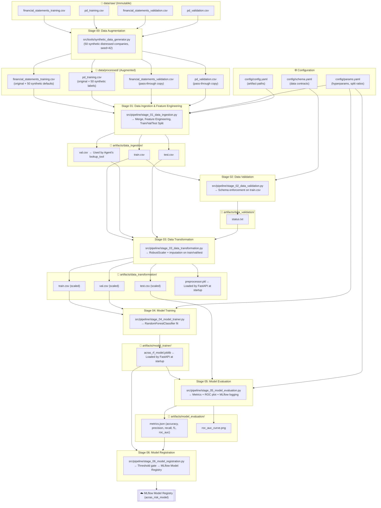

# DVC Pipeline Architecture Report

**Project:** Hybrid Agentic ML for Risk Assessment (ACRAS)
**Document Type:** Architecture · The Map
**Version:** 2.0
**Date:** 2026-03-07
**Status:** Production

---

## 1. Overview

The ACRAS MLOps pipeline is orchestrated by **DVC (Data Version Control)** via `dvc.yaml`. DVC defines a **Directed Acyclic Graph (DAG)** of 7 stages where each stage declares its dependencies, parameters, and outputs. DVC tracks changes to these inputs and skips stages whose inputs haven't changed, enabling reproducible, incrementally-cached experiments.

### Why This Architecture Is Critical

| Principle | Application in ACRAS |
| :--- | :--- |
| **Auditability** | Regulated financial systems must prove which data + code version produced a risk score. DVC links `dvc.lock` to every artifact and persists them in the **Remote Registry**. |
| **Smart Caching** | If only `params.yaml` (model hyperparameters) changes, DVC skips Stages 00–03 and re-runs only from Stage 04 |
| **Data Versioning** | Large CSVs and `.joblib` artifacts are tracked by DVC, keeping Git lightweight |
| **Lineage** | Full traceable path: Raw CSVs → Synthetic Augmentation → Ingestion → Transformation → Training → Evaluation → MLflow Registry |

---

## 2. Complete Pipeline DAG

The pipeline has **7 DVC stages**. Stage 00 (`data_augmentation`) is a **pre-processing prerequisite** that generates class-balanced data before the core FTI (Feature → Training → Inference) pipeline starts.



---

## 3. Stage-by-Stage Breakdown

### Stage 00: Data Augmentation (Pre-requisite)
| Property | Value |
| :--- | :--- |
| **DVC Stage Name** | `data_augmentation` |
| **Script** | `src/tools/synthetic_data_generator.py` |
| **Input** | `data/raw/*.csv` (4 files — immutable) |
| **Output** | `data/processed/*.csv` (4 files) |
| **Purpose** | Addresses class imbalance by generating **50 synthetic distressed companies** (target=1) with statistically plausible characteristics (negative EBITDA, high D/E, low liquidity, low bureau score). Random seed is fixed at `42` for reproducibility. Validation data is pass-through copied. |

### Stage 01: Data Ingestion & Feature Engineering
| Property | Value |
| :--- | :--- |
| **DVC Stage Name** | `data_ingestion` |
| **Script** | `src/pipeline/stage_01_data_ingestion.py` |
| **Component** | `src/components/data_ingestion.py`, `src/features/build_features.py` |
| **Params** | `data_split.test_size`, `data_split.val_size`, `data_split.random_state` |
| **Input** | `data/processed/*.csv` |
| **Output** | `artifacts/data_ingestion/{train,val,test}.csv` |
| **Purpose** | Merges financial statements with PD records. Runs feature engineering (computed ratios). Splits into stratified Train/Val/Test sets. **`val.csv` is the live database used by the agent's `lookup_tool` and `ml_api_tool`.** |

### Stage 02: Data Validation
| Property | Value |
| :--- | :--- |
| **DVC Stage Name** | `data_validation` |
| **Script** | `src/pipeline/stage_02_data_validation.py` |
| **Input** | `artifacts/data_ingestion/train.csv`, `config/schema.yaml` |
| **Output** | `artifacts/data_validation/status.txt` |
| **Purpose** | Enforces the data contract defined in `schema.yaml`. Validates column names, types, and presence of required fields. Downstream Stage 03 depends on `status.txt` to prevent transformation of corrupt data. |

### Stage 03: Data Transformation
| Property | Value |
| :--- | :--- |
| **DVC Stage Name** | `data_transformation` |
| **Script** | `src/pipeline/stage_03_data_transformation.py` |
| **Component** | `src/components/data_transformation.py` |
| **Input** | `artifacts/data_ingestion/{train,val,test}.csv`, `artifacts/data_validation/status.txt` |
| **Output** | `artifacts/data_transformation/{train,val,test}.csv`, **`preprocessor.pkl`** |
| **Purpose** | Fits a scaler on `train.csv` (preventing data leakage) then transforms all three splits. **The `preprocessor.pkl` is the exact same artifact loaded by the FastAPI service at startup**, eliminating training-serving skew. |

### Stage 04: Model Training
| Property | Value |
| :--- | :--- |
| **DVC Stage Name** | `model_trainer` |
| **Script** | `src/pipeline/stage_04_model_trainer.py` |
| **Component** | `src/components/model_trainer.py` |
| **Params** | `model_params.n_estimators`, `model_params.min_samples_leaf`, `model_params.class_weight`, `model_params.n_jobs`, `data_split.random_state` |
| **Input** | `artifacts/data_transformation/train.csv`, `artifacts/data_transformation/val.csv` |
| **Output** | **`artifacts/model_trainer/acras_rf_model.joblib`** |
| **Purpose** | Trains a `RandomForestClassifier` with hyperparameters sourced from `params.yaml`. Model is serialized with `joblib`. This artifact is loaded by the FastAPI prediction service at startup. |

### Stage 05: Model Evaluation
| Property | Value |
| :--- | :--- |
| **DVC Stage Name** | `model_evaluation` |
| **Script** | `src/pipeline/stage_05_model_evaluation.py` |
| **Component** | `src/components/model_evaluation.py` |
| **Input** | `artifacts/data_transformation/test.csv`, `artifacts/model_trainer/acras_rf_model.joblib` |
| **Output** | `artifacts/model_evaluation/metrics.json` (DVC metric, `cache: false`), `roc_auc_curve.png` |
| **Metrics Tracked** | `accuracy`, `precision`, `recall`, `f1_score`, `roc_auc` |
| **MLflow Logging** | Logs params, all 5 metrics, ROC plot artifact, and model object. Fault-tolerant: pipeline continues even if MLflow server is unavailable. |
| **Purpose** | Evaluates on the held-out test set. Generates the ROC curve. As a DVC metric (`cache: false`), `metrics.json` is tracked by Git for `dvc metrics show` and `dvc metrics diff` comparisons across experiments. |

### Stage 06: Model Registration
| Property | Value |
| :--- | :--- |
| **DVC Stage Name** | `model_registration` |
| **Script** | `src/pipeline/stage_06_model_registration.py` |
| **Component** | `src/components/model_registration.py` |
| **Input** | `artifacts/model_trainer/acras_rf_model.joblib`, `artifacts/model_evaluation/metrics.json` |
| **Threshold Gate** | `min_roc_auc` from params. If `roc_auc < threshold`, registration is **skipped** with a warning. |
| **Output** | MLflow Model Registry (registered as `acras_risk_model`) |
| **Purpose** | The quality gate. Only promotes models that pass the performance threshold to the centralized MLflow Model Registry. Gracefully degrades to local artifact storage if the MLflow server is unreachable. |

---

## 4. Key Artifacts & Their Consumers

| Artifact | Produced By | Consumed By |
| :--- | :--- | :--- |
| `artifacts/data_ingestion/val.csv` | Stage 01 | **Agent's `lookup_tool.py` & `ml_api_tool.py`** (live inference database) |
| `artifacts/data_transformation/preprocessor.pkl` | Stage 03 | **FastAPI `main.py`** (loaded at startup) |
| `artifacts/model_trainer/acras_rf_model.joblib` | Stage 04 | **FastAPI `main.py`** (loaded at startup) |
| `artifacts/model_evaluation/metrics.json` | Stage 05 | Stage 06 (threshold gate), MLflow, `dvc metrics show` |

---

## 5. Dual-Entry Orchestration Strategy

To balance production stability with developer velocity, ACRAS supports two execution modes:

| Entry Point | Command | Use Case |
| :--- | :--- | :--- |
| **DVC (Recommended)** | `uv run dvc repro` | Production & reproducibility. Smart DAG caching skips unchanged stages. |
| **Python Script** | `uv run python main.py` | Development & debugging. Forced linear execution; ideal for breakpoints. |

---

## 6. Reproduction Guide

```bash
# 1. Sync to a specific experiment state
git checkout <commit_hash>

# 2. Pull the DVC-tracked data artifacts linked to that commit
uv run dvc pull

# 3. Verify local state matches the committed state
uv run dvc status
# Expected: "Data and pipeline are up to date"

# 4. Re-run (if code/params changed)
uv run dvc repro

# 5. Compare metrics across experiments
uv run dvc metrics show
uv run dvc metrics diff HEAD~1

# 6. Commit and Push the new state
git add dvc.lock params.yaml
git commit -m "Exp: Updated n_estimators=200, min_samples_leaf=5"
uv run dvc push
```

---

## 7. Configuration Files

| File | Purpose |
| :--- | :--- |
| `config/config.yaml` | Artifact directory paths for all stages |
| `config/params.yaml` | Hyperparameters (split ratios, RF params, MLflow URI, registration threshold) |
| `config/schema.yaml` | Data contract enforced by Stage 02 validation |
| `dvc.yaml` | The pipeline DAG definition (stages, deps, outs, params, metrics) |
| `dvc.lock` | Locked hashes of all inputs/outputs for a given experiment run |

---

## 8. Data Registry & Remote Storage

To ensure data persistence and collaborative reproducibility, ACRAS utilizes a **Data Registry** pattern. While Git tracks the code and the metadata (`dvc.lock`), the actual heavy datasets and models are stored in a centralized remote.

### 8.1 Remote Configuration
For this portfolio setup, we use a **Local-as-Remote** strategy to simulate production-grade cloud storage without external dependencies.

| Property | Value |
| :--- | :--- |
| **Remote Name** | `local_storage` (Default) |
| **Storage Type** | Local Filesystem (Simulated Cloud) |
| **Path** | `C:\dvc_remotes\ACRAS` |
| **Content Addressing** | MD5-based CAS (Content-Addressable Storage) |

### 8.2 Collaborative Workflow
The integration of a remote storage enables the following high-integrity lifecycle:

1.  **Push**: After a successful `dvc repro`, the engineer runs `dvc push` to upload the new artifacts to the registry.
2.  **Versioning**: The MD5 hashes in `dvc.lock` act as pointers to the exact file versions in the remote.
3.  **Pull**: A collaborator (or a CI/CD agent) runs `git pull` followed by `dvc pull` to instantly reconstruct the exact experiment state, bypassing the need to re-run heavy training stages.

## 9. View the Remote Storage

To view your DVC remote configuration and the data it contains, you can use the following methods:

### 1. View the Remote Configuration
To see the name and URL of the remotes you have configured in the project:
```powershell
uv run dvc remote list
```
*This will show `local_storage  C:\dvc_remotes\ACRAS`.*

### 2. View the Remote Storage (Physical Location)
Since we configured a **local remote**, you can simply browse the directory using your file explorer or the terminal:
```powershell
ls C:\dvc_remotes\ACRAS
```

### 3. Understanding the Remote Structure
DVC uses **Content-Addressable Storage (CAS)**. When you look inside `C:\dvc_remotes\ACRAS`, you won't see familiar filenames like `raw.csv`. Instead, you will see a structure of two-character folders (e.g., `0a/`, `1b/`).
*   **Why?** DVC renames files based on their **MD5 hash**.
*   **Verification**: If you want to see exactly what is tracked and what the hashes are, you can run:
    ```powershell
    uv run dvc list . data --dvc-only
    ```

### 4. Check Sync Status
If you want to know if your local data is perfectly in sync with that remote:
```powershell
uv run dvc status -r local_storage
```

---
**Pro-Tip for Portfolios**: 
In a real production environment, this remote would be an **S3 bucket** or **Azure Blob Storage**. The command to view it would be the same (`dvc remote list`), but the URL would look like `s3://my-bucket/acras-data`. Using a local folder like `C:\dvc_remotes` is the best way to demonstrate you understand the **Data Registry** concept without needing a cloud subscription!