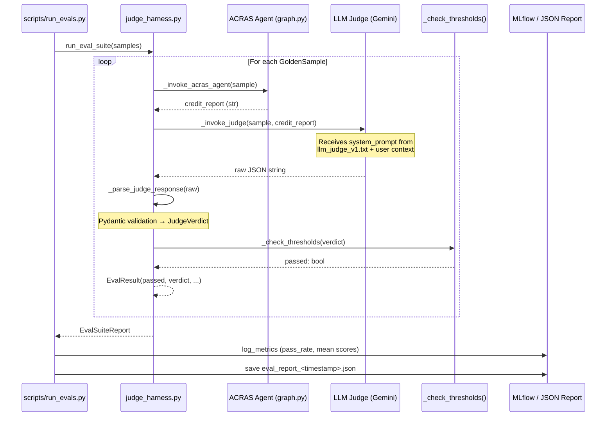

# LLM-as-a-Judge Evaluation Layer — Architecture Report

**Project:** Hybrid Agentic ML for Risk Assessment (ACRAS)
**Document Type:** Architecture · The Map
**Version:** 1.0
**Date:** 2026-05-13
**Status:** Production (Advanced Maturity — Sprint 3)

---

## 1. Executive Summary

The **LLM-as-a-Judge Evaluation Layer** is the qualitative validation tier of the ACRAS system. It sits above the deterministic unit test pyramid and below a future live-traffic A/B harness, filling the gap that unit tests cannot address: *"Is the agent's reasoning good?"*

The layer implements the **Brain vs. Brawn** philosophy at the evaluation level:

- **Brain (Judge LLM):** A second, isolated language model receives the ACRAS agent's output and scores it on four axes — Relevance, Faithfulness, Tool Usage, and Business Value Alignment.
- **Brawn (Threshold Gate):** A deterministic Python function applies the mandated pass/fail thresholds from the table below. No language model participates in the final PASS/FAIL decision.

| Dimension | Governs | Threshold |
| :--- | :--- | :---: |
| **Relevance** | Does the response address the credit-risk query? | ≥ 4/5 |
| **Faithfulness** | Are all quantitative claims grounded in retrieved data? | ≥ 4/5 |
| **Tool Usage** | Did the agent call the correct tools? | ≥ 4/5 |
| **Business Value Alignment** | Does the directive (APPROVE/REJECT/REVIEW) move a KPI? | ≥ 3/5 |

The layer is backed by a **20-sample golden dataset** (`golden_dataset.json`) covering all three risk tiers (LOW, MEDIUM, HIGH) and all three recommendation types (APPROVE, REJECT, REVIEW). Before any production deployment, the entire dataset MUST be evaluated and all samples MUST achieve passing scores on all four axes.

---

## 2. Module Map

The evaluation layer is implemented in `src/evals/` and integrates with the existing prompt infrastructure in `src/agents/prompts/`:

```
src/
├── evals/
│   ├── __init__.py              ← Package declaration
│   ├── schemas.py               ← Pydantic data contracts (GoldenSample, JudgeVerdict, EvalResult, EvalSuiteReport)
│   ├── judge_harness.py         ← Orchestration logic: agent call → judge call → threshold gate
│   └── golden_dataset.json      ← 20 curated (input, expected_output) golden samples
│
├── agents/
│   └── prompts/
│       └── system_prompts/
│           └── llm_judge_v1.txt ← Versioned judge system prompt (No Naked Prompts policy)
│
scripts/
└── run_evals.py                 ← CLI runner: full suite / dry-run / MLflow logging
```

---

## 3. System Architecture

### 3.1 Two-LLM Architecture

The evaluation layer deliberately uses **two separate LLM invocations** to avoid self-assessment bias:

```
┌─────────────────────────────────────────────────────────────────────┐
│                   EVALUATION PIPELINE                               │
│                                                                     │
│  ┌──────────────────┐    Credit Report     ┌──────────────────────┐│
│  │  ACRAS Agent     │ ──────────────────►  │  LLM Judge           ││
│  │  (LangGraph      │                      │  (Gemini Flash,      ││
│  │   Relay Team)    │                      │   isolated instance) ││
│  └──────────────────┘                      └──────────┬───────────┘│
│                                                       │             │
│                                             JudgeVerdict (JSON)     │
│                                                       │             │
│                                            ┌──────────▼───────────┐│
│                                            │  Threshold Gate      ││
│                                            │  (deterministic)     ││
│                                            │  PASS / FAIL         ││
│                                            └──────────────────────┘│
└─────────────────────────────────────────────────────────────────────┘
```

The **ACRAS Agent** (the system under test) is the full LangGraph relay from `src/agents/graph.py`. It is invoked end-to-end, meaning financial tools, the ML API call, and CRO synthesis all execute — this is a full integration eval, not a mock.

The **LLM Judge** is a fresh, tool-free instance of the Gemini Flash model. It has no access to the ACRAS tool suite and cannot modify any state. Its sole function is to reason about the quality of the credit report it receives, then emit a structured JSON verdict.

### 3.2 Structured Output Enforcement

The Judge is constrained to emit **JSON-only output** via its system prompt (`llm_judge_v1.txt`). The harness applies a two-layer validation gate on this output:

1. **Schema Gate (Pydantic):** The raw JSON string is parsed into a `JudgeVerdict` model. Any missing field, wrong type, or out-of-range score (< 1 or > 5) raises a `ValidationError` immediately — never silently discarded.
2. **Markdown Fence Tolerance:** Despite explicit JSON-only instructions, some models wrap output in ` ```json ``` ` fences. The `_parse_judge_response()` function strips these with a regex before attempting JSON parsing, making the harness robust to this common model behavior without relaxing the schema contract.

### 3.3 Pydantic Schema Layer

All data flowing through the evaluation pipeline is schema-bound with `extra="forbid"`:

```
GoldenSample          ← Input contract for each golden dataset entry
    │
    ├── sample_id, company_id, scenario_description
    ├── input_query              ← Sent verbatim to the ACRAS agent
    ├── expected_keywords        ← Used for relevance pre-check
    ├── expected_recommendation  ← APPROVE | REJECT | REVIEW (Literal type)
    ├── expected_risk_tier       ← LOW | MEDIUM | HIGH (Literal type)
    └── ground_truth_ratios      ← Financial ratios for faithfulness validation

JudgeVerdict          ← Structured LLM Judge output
    ├── relevance: DimensionScore
    ├── faithfulness: DimensionScore
    ├── tool_usage: DimensionScore
    ├── business_value: DimensionScore
    └── overall_summary: str

DimensionScore        ← Per-axis score container
    ├── score: int (ge=1, le=5)
    ├── justification: str
    └── pass_threshold: int

EvalResult            ← Per-sample result (agent response + verdict + pass flag)
EvalSuiteReport       ← Aggregated suite metrics (pass rate, mean scores)
```

### 3.4 Golden Dataset Architecture

The golden dataset (`golden_dataset.json`) is the **ground truth contract** for the eval layer. It is structured as:

```json
{
  "version": "1.0.0",
  "axes": { ... },
  "samples": [
    {
      "sample_id": "GD-001",
      "company_id": 1,
      "scenario_description": "Healthy company — should result in APPROVE.",
      "input_query": "...",
      "expected_keywords": ["APPROVE", "Current Ratio", ...],
      "expected_recommendation": "APPROVE",
      "expected_risk_tier": "LOW",
      "ground_truth_ratios": { "current_ratio": 1.8, ... }
    },
    ...
  ]
}
```

**Dataset Coverage Requirements (pre-deployment gate):**

| Coverage Axis | Requirement | Status |
| :--- | :---: | :---: |
| Total samples | ≥ 20 | ✅ 20 samples |
| LOW risk tier | ≥ 1 sample | ✅ 8 samples |
| MEDIUM risk tier | ≥ 1 sample | ✅ 6 samples |
| HIGH risk tier | ≥ 1 sample | ✅ 6 samples |
| APPROVE recommendation | ≥ 1 sample | ✅ 8 samples |
| REJECT recommendation | ≥ 1 sample | ✅ 6 samples |
| REVIEW recommendation | ≥ 1 sample | ✅ 6 samples |

---

## 4. Execution Flow

### 4.1 Full End-to-End Sequence



### 4.2 Dry-Run Mode

The harness supports a `dry_run=True` flag that bypasses **all LLM calls** and returns a synthetic `EvalResult` with all dimensions at their pass thresholds. This mode serves two purposes:

1. **CI Pipeline Wiring Tests:** Validates the entire pipeline (dataset loading → Pydantic schemas → threshold gate → report aggregation) without API cost.
2. **Pre-deployment Smoke Test:** Confirms the runner, output directory, and MLflow integration are correctly configured before an expensive full suite run.

```
make evals-dry-run   ← Zero API cost; validates pipeline wiring
make evals           ← Full live suite (requires API keys)
```

---

## 5. Integration with the Broader ACRAS System

### 5.1 Position in the Quality Stack

The LLM-as-a-Judge layer occupies a distinct tier in the ACRAS quality assurance stack, complementing — not replacing — the existing layers:

```
┌─────────────────────────────────────────────────────────┐
│  Layer 4: Live Traffic Monitoring (OTel, Grafana)       │  Future
├─────────────────────────────────────────────────────────┤
│  Layer 3: LLM-as-a-Judge Eval (Qualitative)             │  ← This system
│           100 tests + 20 golden scenarios               │
├─────────────────────────────────────────────────────────┤
│  Layer 2: Integration & API Tests (pytest -m integration│
│           pytest -m app) — FastAPI contract validation  │
├─────────────────────────────────────────────────────────┤
│  Layer 1: Unit Tests (pytest -m unit) — 78+ tests       │
│           Deterministic tools, schemas, pipeline stages │
└─────────────────────────────────────────────────────────┘
```

### 5.2 Prompt Management Integration

The judge system prompt (`llm_judge_v1.txt`) is managed via the same `prompt_loader.py` utility used by the agent cluster, enforcing the No Naked Prompts policy system-wide. To upgrade the judge's evaluation criteria, a developer creates `llm_judge_v2.txt` and updates the `get_prompt()` call in `judge_harness.py` — a single-line change, versioned in Git.

### 5.3 MLflow Integration

Eval suite results are logged to MLflow under the `llm_judge_eval` run name with the following metrics:

| MLflow Metric | Description |
| :--- | :--- |
| `eval/pass_rate` | Fraction of samples that passed all four thresholds |
| `eval/mean_relevance` | Mean relevance score across all evaluated samples |
| `eval/mean_faithfulness` | Mean faithfulness score across all evaluated samples |
| `eval/mean_tool_usage` | Mean tool usage score across all evaluated samples |
| `eval/mean_business_value` | Mean business value score across all evaluated samples |

This enables trend analysis: if a prompt change causes `eval/mean_faithfulness` to drop across suite runs, the regression is immediately visible in MLflow without manual inspection.

---

## 6. Design Decisions

| Decision | Choice | Rationale |
| :--- | :--- | :--- |
| **Two-model architecture** | Separate judge LLM from agent LLM | Eliminates self-assessment bias; judge has zero shared state with the agent |
| **JSON-only judge output** | Enforced via system prompt + Pydantic validation | Structured output is testable, schema-bound, and ML-pipeline-compatible |
| **Deterministic threshold gate** | `_check_thresholds()` in Python, not LLM | PASS/FAIL decisions MUST NOT be probabilistic; rule 1.2 (Brain vs. Brawn) |
| **Golden dataset as JSON** | `golden_dataset.json` in `src/evals/` | Version-controlled; DVC-trackable; human-readable; schema-validated at load time |
| **Gemini Flash as judge model** | No tool binding, temperature=0 | Maximises output consistency; no side-effects possible from a tool-free judge |
| **Dry-run mode** | `dry_run=True` flag in harness | Enables CI wiring validation with zero API cost |
| **`pass_threshold` injection** | Parser adds default thresholds if LLM omits them | Tolerates partial compliance from the judge without relaxing the schema contract |
| **Report persistence** | Timestamped JSON in `reports/docs/evaluations/` | Immutable audit trail; aligns with the Five Pillars taxonomy (Rule 5.2) |

---

## 7. Constraints & Known Limitations

| Constraint | Impact | Mitigation |
| :--- | :--- | :--- |
| Full agent run per sample | High latency (~30–60s per sample × 20 = up to 20 min) | Run on schedule (nightly CI) or against subsets; dry-run for wiring checks |
| Judge LLM has no ground truth access | Cannot verify if `current_ratio` value cited is arithmetically correct | Ground truth ratios in `GoldenSample.ground_truth_ratios` are used as context for the judge's faithfulness assessment |
| Golden dataset covers `val.csv` IDs 1–20 | Eval scope is limited to companies present in the validation set | Expand dataset when new risk profiles or edge cases are identified |
| Judge model availability | Suite fails if Gemini API is unavailable | `EvalResult.error` captures the failure; suite continues; report identifies which samples errored |

---

## 8. Related Documents

| Document | Location | Relationship |
| :--- | :--- | :--- |
| Agentic Reasoning Engine Architecture | `reports/docs/architecture/agentic_reasoning_engine.md` | Describes the ACRAS agent (the system under test) |
| LLM-as-a-Judge Technical Implementation | `reports/docs/workflows/llm_judge_workflow.md` | Step-by-step implementation guide for this layer |
| Codebase Review v2.0 | `reports/docs/evaluations/codebase_review_v2.0.md` | Gap 4.11 resolution record |
| Observability & Tracing | `reports/docs/architecture/observability_tracing.md` | OTel integration that complements eval observability |
