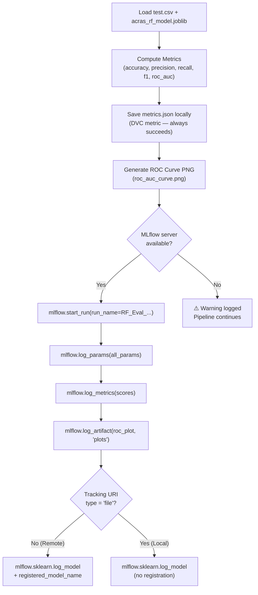
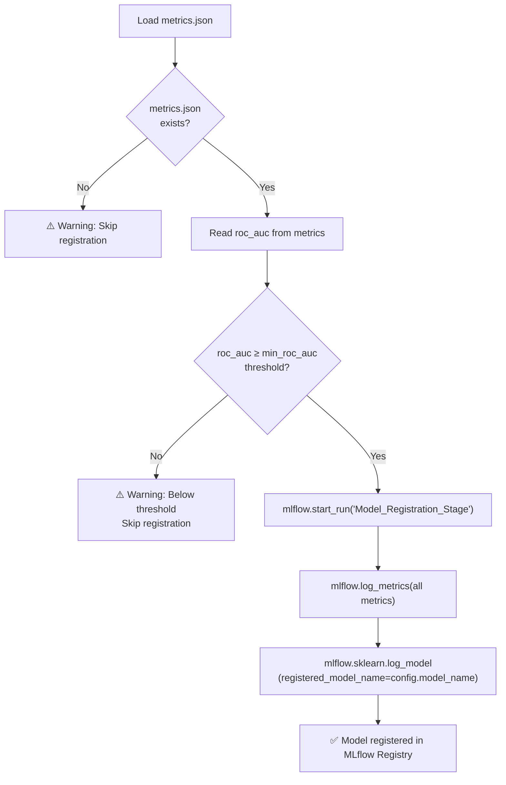
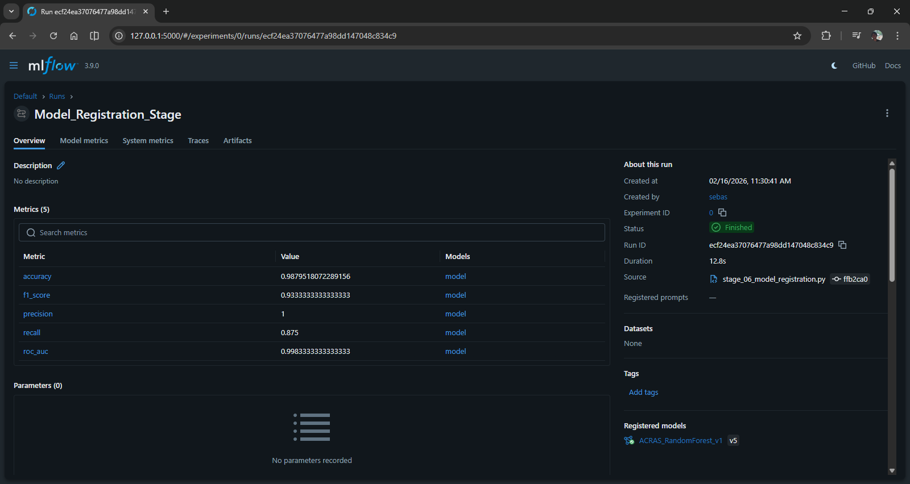

# MLflow Integration — Architecture Report

**Project:** Hybrid Agentic ML for Risk Assessment (ACRAS)
**Document Type:** Architecture · The Map
**Version:** 2.0
**Date:** 2026-03-07
**Status:** Production

---

## 1. Overview

**MLflow** is ACRAS's centralized experiment tracking and model registry layer. It records every model training run with full parameter and metric lineage, enabling reproducible experiments and governed model promotion. The integration is **fault-tolerant by design**: if the MLflow server is unreachable, the DVC pipeline continues successfully and falls back to local artifact storage.

MLflow is active in two separate pipeline stages:
- **Stage 05 (Evaluation):** Logs parameters, metrics, plots, and the model object via `mlflow.sklearn.log_model`.
- **Stage 06 (Registration):** Applies a quality gate and registers the model to the MLflow Model Registry.

### Why MLflow?
In an Agentic MLOps environment, the LLM ("The Brain") needs to inspect model performance history to make informed decisions. MLflow provides the API interface for both human engineers and AI agents to:
*   **Compare Experiments**: Instantly see which hyperparameters yielded the best recall.
*   **Trace Artifacts**: Link specific model weights to their evaluation plots.
*   **Register Models**: Promote successful candidates to a centralized "Model Registry."

---

## 2. Architecture & Configuration

### 2.1 URI Resolution — `src/utils/mlflow_config.py`

All MLflow tracking URI resolution is centralized in `get_mlflow_uri()`. This utility is environment-aware and applies the following **4-level priority chain**:

```
Priority 1: OS / .env environment variable (MLFLOW_TRACKING_URI)
    ↓ (if not set)
Priority 2: ENV-based defaults
    - ENV=production  → RAISES RuntimeError (requires explicit URI — no silent fallback)
    - ENV=staging     → http://staging-mlflow-server:5000
    ↓ (if ENV=local or unset)
Priority 3: config/params.yaml → mlflow.uri key
    ↓ (if params.yaml missing or mlflow.uri not defined)
Priority 4: Local fallback → http://127.0.0.1:5000 (Local Tracking Server)
```

> **Production Constraint:** In `ENV=production`, the system **raises `RuntimeError`** if `MLFLOW_TRACKING_URI` is not set. This prevents silent local tracking that could lose production experiment data.

```python
# Usage across pipeline stages:
from src.utils.mlflow_config import get_mlflow_uri
mlflow_uri = get_mlflow_uri()
```

### 2.2 Experiment & Run Naming Conventions

| Parameter | Value |
| :--- | :--- |
| **Experiment Name** | `ACRAS_Risk_Assessment` (configurable via `config/params.yaml`) |
| **Evaluation Run Naming** | `RF_Eval_YYYY_MM_DD_HH_MM` (timestamp-based, auto-generated) |
| **Registration Run Name** | `Model_Registration_Stage` (fixed) |
| **MLflow Model Name** | `acras_risk_model` (configurable via `config.yaml`) |
| **Registered Model Name** | Configurable via `ModelRegistrationConfig` |

---

## 3. Stage 05 — Evaluation Tracking (`model_evaluation.py`)

This is the primary MLflow integration point. It is **deliberately fault-tolerant**: even if `mlflow.start_run()` fails, the DVC pipeline proceeds and `metrics.json` is still saved locally.

### Tracking Execution Flow



### What Is Logged

| Category | Logged Items |
| :--- | :--- |
| **Parameters** | `n_estimators`, `min_samples_leaf`, `class_weight`, `n_jobs`, `random_state` (from `config.all_params`) |
| **Metrics** | `accuracy`, `precision`, `recall`, `f1_score`, `roc_auc` |
| **Artifacts** | `roc_auc_curve.png` (saved under `plots/` subfolder in the run) |
| **Model** | Trained `RandomForestClassifier` via `mlflow.sklearn.log_model` |

### Remote vs. Local Model Logging

The component automatically detects the tracking URI type and gates model registration accordingly:

```python
if tracking_url_type_store != "file":
    # Remote server: log + auto-register in Model Registry
    mlflow.sklearn.log_model(model, artifact_path, registered_model_name=...)
else:
    # Local ./mlruns: log model artifact only (no Registry)
    mlflow.sklearn.log_model(model, artifact_path)
```

### MLflow URI Resolution (Stage 05)

Stage 05 uses the centralized `get_mlflow_uri()` utility, which prioritizes the local server (`http://127.0.0.1:5000`) even in local-mode fallbacks to ensure Model Registry availability.

```python
mlflow_uri = get_mlflow_uri()
mlflow.set_registry_uri(mlflow_uri)
mlflow.set_tracking_uri(mlflow_uri)
```

If even setting the experiment fails (e.g., server connection timeout), it falls back again to `file:./mlruns` and retries locally.

---

## 4. Stage 06 — Model Registration (`model_registration.py`)

Stage 06 is the **quality gate**: it loads `metrics.json` produced by Stage 05 and registers the model in the MLflow Model Registry only if it meets the configured `min_roc_auc` threshold.

### Registration Logic



### Graceful Degradation

If the MLflow server is unreachable during registration, the component logs a warning and falls back to local artifact storage:

```python
if "connection" in str(e).lower() or "active run" in str(e).lower():
    logger.warning("MLflow connection failed. Falling back to local artifact storage.")
```

This prevents a missing MLflow server from blocking the entire pipeline.

---

## 5. Environment Isolation

| Environment | Configuration | Behavior |
| :--- | :--- | :--- |
| **Local** | `ENV=local` (default) | Tracks to `./mlruns` or `params.yaml` URI |
| **Staging** | `ENV=staging` | Auto-routes to `http://staging-mlflow-server:5000` |
| **Production** | `ENV=production` + `MLFLOW_TRACKING_URI` secret | Raises `RuntimeError` if URI is not explicitly set |
| **CI/CD** | Set `MLFLOW_TRACKING_URI` env var in pipeline | Overrides all other settings (Priority 1) |

---

## 6. Viewing Experiments Locally

```bash
# Start the MLflow UI (using the production-ready local config)
.\launch_mlflow.bat

# Then open: http://127.0.0.1:5000
```




```bash
# Compare metrics across DVC experiments (from CLI)
uv run dvc metrics show          # Show current metrics.json
uv run dvc metrics diff HEAD~1   # Compare with previous commit
```

---

## 7. Key Design Decisions

| Decision | Rationale |
| :--- | :--- |
| **Fault-tolerant MLflow** | DVC produces `metrics.json` regardless of MLflow availability, ensuring the pipeline always succeeds |
| **Threshold gating in Stage 06** | Only quality-approved models reach the Registry; bad experiments are logged but not promoted |
| **`min_roc_auc` from `params.yaml`** | The promotion threshold is versioned alongside code, making it auditable |
| **`ENV=production` raises error** | Prevents silent local tracking in prod; enforces explicit operational config |
| **Separate evaluation & registration stages** | Evaluation (Stage 05) always runs; registration (Stage 06) only runs when quality is confirmed |
