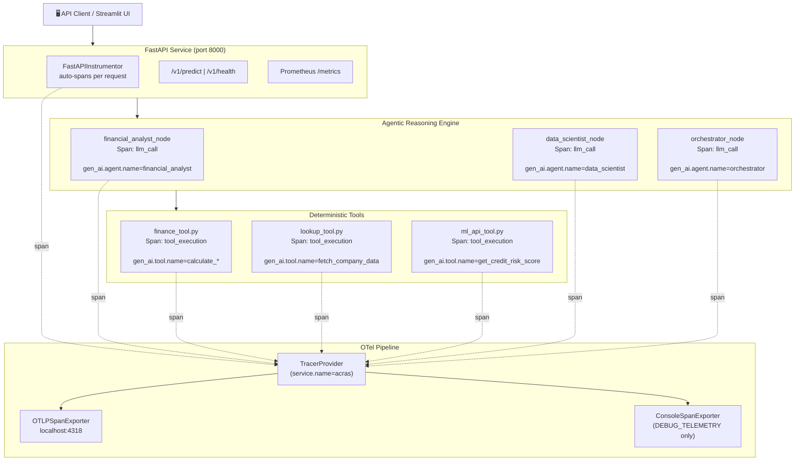

# Observability & Tracing Architecture — Report

**Project:** Hybrid Agentic ML for Risk Assessment (ACRAS)
**Document Type:** Architecture · The Map
**Version:** 1.0
**Date:** 2026-05-08
**Status:** Production (Phase 3: Elite Infrastructure)

---

## 1. Executive Summary

The **ACRAS Observability Stack** provides end-to-end distributed tracing across the full request lifecycle — from the FastAPI prediction service to the multi-agent LangGraph relay and each deterministic tool execution. Tracing is implemented using **OpenTelemetry (OTel)**, the CNCF industry standard, with semantic attributes following the **`gen_ai.*` conventions** for LLM/agent observability.

This makes every agent invocation, LLM call, tool execution, and API request traceable in any OTel-compatible backend (Jaeger, Honeycomb, Grafana Tempo, Datadog).

---

## 2. Architecture Overview



---

## 3. Module Map

```
src/
├── utils/
│   └── telemetry.py        ← TracerProvider bootstrap (OTLP + Console exporters)
├── app/
│   ├── main.py             ← FastAPIInstrumentor.instrument_app() integration
│   └── api/
│       └── endpoints.py    ← Rate-limited endpoint handlers (slowapi)
└── agents/
    ├── graph.py            ← LLM call spans with gen_ai.* attributes
    └── tools/
        ├── finance_tool.py ← tool_execution span on every calculator
        ├── lookup_tool.py  ← tool_execution span on data fetch
        └── ml_api_tool.py  ← tool_execution span on ML API call
```

---

## 4. Component Details

### 4.1 Telemetry Bootstrap — `src/utils/telemetry.py`

`configure_tracer()` is called once during the FastAPI `lifespan` startup event. It creates a `TracerProvider` with a `Resource` carrying the service identity, and conditionally attaches exporters.

```python
resource = Resource.create({
    "service.name":           service_name,   # default: "acras"
    "deployment.environment": environment,    # default: "production"
})
provider = TracerProvider(resource=resource)
```

**Exporter Configuration Logic:**

| Condition | Exporter Activated |
| :--- | :--- |
| `OTEL_EXPORTER_OTLP_ENDPOINT` is set **or** `TESTING` is not set | `OTLPSpanExporter` (→ collector at `localhost:4318`) |
| `DEBUG_TELEMETRY=1` | `ConsoleSpanExporter` (→ stdout, for local debugging) |
| `TESTING=1` | All exporters **suppressed** (CI safety gate) |

> **CI Hygiene:** The `suppress_otel_export` autouse fixture in `tests/conftest.py` sets `TESTING=1` before every test, preventing any network export attempts during the test suite.

---

### 4.2 FastAPI Auto-Instrumentation — `src/app/main.py`

The `FastAPIInstrumentor` intercepts all HTTP requests at the WSGI/ASGI boundary and automatically creates a root span for each request.

```python
FastAPIInstrumentor.instrument_app(app)
```

**Automatically captured attributes per request:**
- `http.method`, `http.url`, `http.status_code`
- `http.route` (e.g., `/v1/predict`)
- End-to-end request duration

---

### 4.3 LLM Agent Spans — `src/agents/graph.py`

Every call to `invoke_with_fallback()` creates a child span named `llm_call` with semantic `gen_ai.*` attributes. This enables filtering traces by agent role, provider tier, and model name in any OTel backend.

**Span Attributes:**

| Attribute | Example Value | Description |
| :--- | :--- | :--- |
| `gen_ai.system` | `"gemini"` or `"huggingface"` | LLM provider identifier |
| `gen_ai.agent.name` | `"financial_analyst"` | Role of the invoking agent node |
| `gen_ai.request.tier` | `"tier_1"` / `"tier_2"` / `"tier_3"` | Fallback tier used for the call |
| `gen_ai.request.model` | `"gemini-2.5-flash"` | Resolved model name |

---

### 4.4 Deterministic Tool Spans — `src/agents/tools/`

All three tool modules wrap their core execution logic in a `tool_execution` span. This allows tracing tool call latency independently from LLM reasoning time.

| Tool | Span Name | `gen_ai.tool.name` attribute |
| :--- | :--- | :--- |
| `calculate_debt_to_equity` | `tool_execution` | `"calculate_debt_to_equity"` |
| `calculate_ebitda_margin` | `tool_execution` | `"calculate_ebitda_margin"` |
| `calculate_current_ratio` | `tool_execution` | `"calculate_current_ratio"` |
| `calculate_revenue_growth` | `tool_execution` | `"calculate_revenue_growth"` |
| `fetch_company_data` | `tool_execution` | `"fetch_company_data"` |
| `get_credit_risk_score` | `tool_execution` | `"get_credit_risk_score"` |

---

## 5. Span Hierarchy (Trace Waterfall)

A complete ACRAS risk assessment trace has the following parent-child span structure:

```
[HTTP] POST /v1/predict
└── [FastAPI] http_request
    └── [Agent] llm_call (financial_analyst, tier_1)
        ├── [Tool] tool_execution (fetch_company_data)
        ├── [Tool] tool_execution (calculate_debt_to_equity)
        ├── [Tool] tool_execution (calculate_ebitda_margin)
        ├── [Tool] tool_execution (calculate_current_ratio)
        └── [Tool] tool_execution (calculate_revenue_growth)
    └── [Agent] llm_call (data_scientist, tier_1)
        └── [Tool] tool_execution (get_credit_risk_score)
    └── [Agent] llm_call (orchestrator, tier_1)
```

> **Fallback Visibility:** If a tier switch occurs, the span's `gen_ai.request.tier` attribute will reflect the actual tier used (e.g., `"tier_2"`), making provider degradation visible in dashboards without log-scraping.

---

## 6. Environment Variables Reference

| Variable | Purpose | Default |
| :--- | :--- | :--- |
| `OTEL_EXPORTER_OTLP_ENDPOINT` | OTLP collector endpoint | `http://localhost:4318/v1/traces` |
| `DEBUG_TELEMETRY` | Enables `ConsoleSpanExporter` for local debugging | `""` (disabled) |
| `TESTING` | Suppresses all exporters for CI runs | `""` (not set in production) |
| `OTEL_SDK_DISABLED` | OTel SDK-level kill switch (set by test fixture) | `""` |

---

## 7. Local Collector Setup (Jaeger)

To visualize traces locally during development, run a Jaeger all-in-one collector that accepts OTLP:

```bash
docker run --rm -d \
  -p 16686:16686 \  # Jaeger UI
  -p 4318:4318   \  # OTLP HTTP receiver
  jaegertracing/all-in-one:latest
```

Then set the environment variable to point the OTLP exporter at it:

```dotenv
# .env
OTEL_EXPORTER_OTLP_ENDPOINT=http://localhost:4318/v1/traces
```

Start the ACRAS service and run an agent workflow. Open `http://localhost:16686` to inspect the full trace waterfall.

---

## 8. Usage Guide: ACRAS Elite Observability

To enable and use distributed tracing in your local environment, follow these steps:

1.  **Spin up the Collector:** Run the Jaeger all-in-one container as described in Section 7.
2.  **Verify Configuration:** Ensure `OTEL_EXPORTER_OTLP_ENDPOINT` is set to `http://localhost:4318/v1/traces` in your `.env` file (this is the default used by the SDK if not specified).
3.  **Launch the System:** Run `launch_acras.bat`. The script will notify you that the observability stack is active.
4.  **Execute a Request:** Navigate to the Streamlit UI (`http://localhost:8501`) and run a company risk analysis.
5.  **Inspect the Trace:**
    *   Open **[http://localhost:16686](http://localhost:16686)**.
    *   Select `acras` from the "Service" dropdown.
    *   Click "Find Traces".
    *   Click on a trace to see the complete waterfall of LLM reasoning, tool calls, and API performance.

---

## 9. Key Design Decisions

| Decision | Choice | Rationale |
| :--- | :--- | :--- |
| **OTel standard** | CNCF OpenTelemetry | Vendor-neutral; compatible with all major backends (Jaeger, Honeycomb, Datadog) |
| **Semantic conventions** | `gen_ai.*` | Emerging standard for LLM observability; backend-agnostic agent attribution |
| **FastAPI auto-instrumentation** | `FastAPIInstrumentor` | Zero-code change coverage for all HTTP routes; propagates trace context automatically |
| **Manual spans on tools** | `tracer.start_as_current_span()` | Deterministic tools need explicit attribution; auto-instrumentation doesn't cover internal Python calls |
| **CI export suppression** | `TESTING=1` + autouse fixture | Prevents test suite network calls and flakiness from collector unavailability |
| **Single `TracerProvider`** | Bootstrapped at lifespan startup | Avoids duplicate provider registration; single source of truth for service identity |
