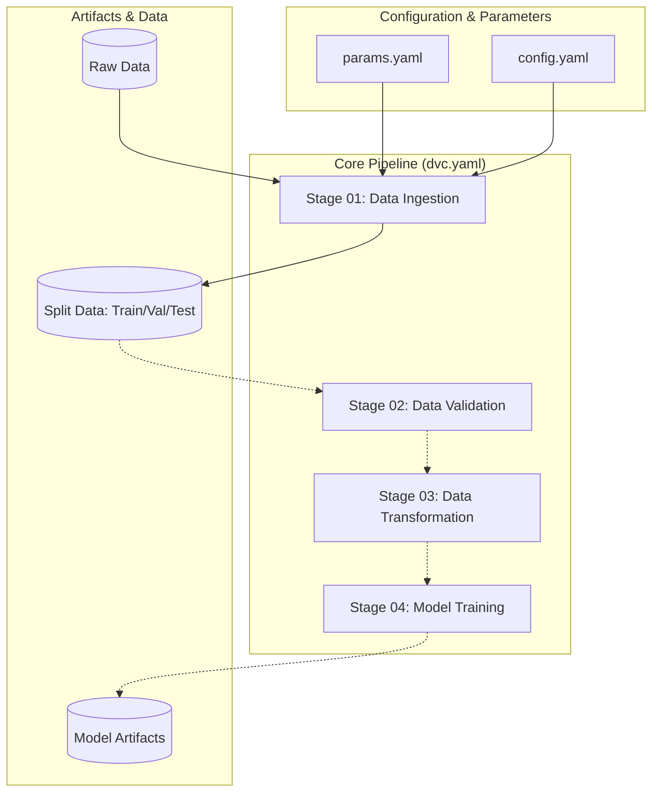

# DVC Pipeline Architecture Report

## Overview
The Agentic Credit Risk Assessment System (ACRAS) uses **DVC (Data Version Control)** as the core orchestration engine for its MLOps pipeline. This ensures that every experiment is reproducible, traceable, and versioned alongside the code.

## Architecture Diagram

## Strategy: The Dual-Entry Pattern
To balance production stability with developer velocity, ACRAS implements a **Dual-Entry Orchestration Strategy**:

| Entry Point | Utility | Philosophy |
| :--- | :--- | :--- |
| `uv run dvc repro` | **Production & Reproducibility** | Ensures the DAG (Directed Acyclic Graph) is consistent. Uses caching to skip unchanged stages. |
| `uv run python main.py` | **Development & Debugging** | Forced linear execution. Ideal for IDE breakpoints and rapid logic iteration without DVC overhead. |

## Pipeline Definition (`dvc.yaml`)
Each stage in `dvc.yaml` captures:
*   **Command**: The specific python script to execute.
*   **Dependencies**: Code files and configurations that, if changed, trigger a re-run.
*   **Parameters**: Variables from `params.yaml` that influence the stage.
*   **Outputs**: Directories or files generated by the stage (tracked by DVC).

## Reproduction Guide
To reproduce the current state of the pipeline:

1.  **Pull Data**: `dvc pull` (if remote is configured).
2.  **Run Pipeline**: `uv run dvc repro`.
3.  **Check Status**: `dvc status`.
