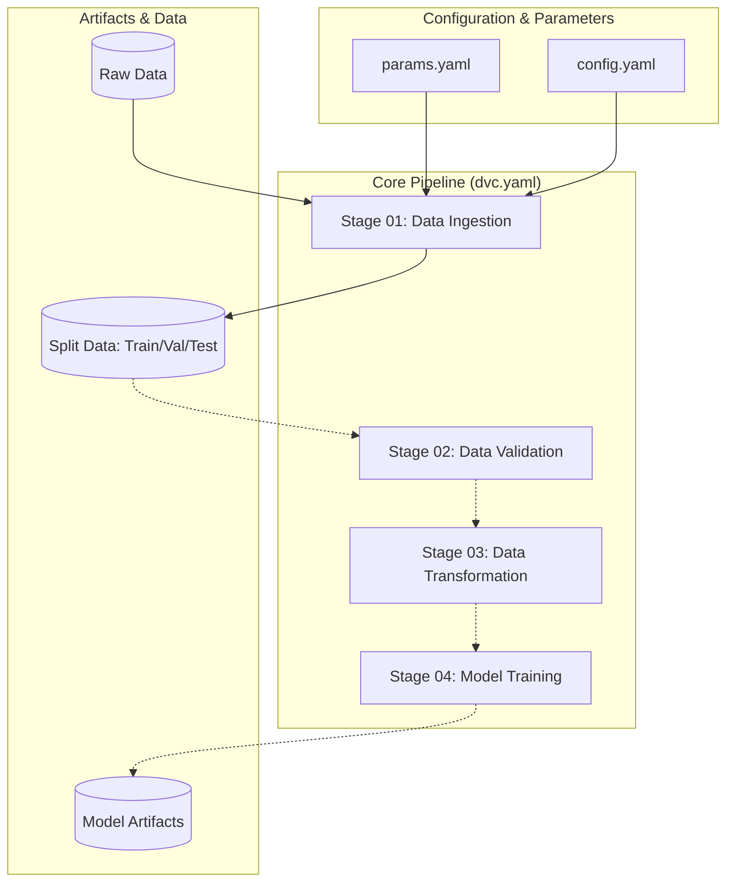

# DVC Pipeline Architecture Report

The Agentic Credit Risk Assessment System (ACRAS) uses **DVC (Data Version Control)** as the core orchestration engine for its MLOps pipeline. This ensures that every experiment is reproducible, traceable, and versioned alongside the code.

## Why This Is Critical
The DVC-centric architecture is the backbone of ACRAS for several reasons:
*   **Auditability**: In financial risk assessment, we must be able to prove exactly which data and which code version produced a specific risk score. DVC provides this "paper trail".
*   **Dependency Management**: By defining the DAG, DVC ensures that if we change a data generation parameter in `params.yaml`, the system *automatically* knows it must re-ingest the data and re-train the models.
*   **Storage Efficiency**: Only metadata is stored in Git. Large datasets and models are stored in external storage, keeping the repository lightweight and high-performing.

## Architecture Diagram



## Strategy: The Dual-Entry Pattern
To balance production stability with developer velocity, ACRAS implements a **Dual-Entry Orchestration Strategy**:

| Entry Point | Utility | Philosophy |
| :--- | :--- | :--- |
| `uv run dvc repro` | **Production & Reproducibility** | Ensures the DAG (Directed Acyclic Graph) is consistent. Uses caching to skip unchanged stages. |
| `uv run python main.py` | **Development & Debugging** | Forced linear execution. Ideal for IDE breakpoints and rapid logic iteration without DVC overhead. |

## Pipeline Definition (`dvc.yaml`)
Each stage in `dvc.yaml` captures:
*   **Command**: The specific python script to execute.
*   **Dependencies**: Code files and configurations that, if changed, trigger a re-run.
*   **Parameters**: Variables from `params.yaml` that influence the stage.
*   **Outputs**: Directories or files generated by the stage (tracked by DVC).

## Reproduction Guide: Exact Results
To reproduce the current state of the pipeline bit-for-bit:

1.  **Sync Code**: Ensure you are on the correct Git commit.
    ```bash
    git checkout <commit_hash>
    ```
2.  **Sync Data**: Retrieve the exact data artifacts linked to that commit.
    ```bash
    uv run dvc pull
    ```
3.  **Validate State**: Check if your local environment matches the committed state.
    ```bash
    uv run dvc status
    ```
    *If it shows "Data and pipeline are up to date", the state is identical to the production/experiment record.*
4.  **Execute (if needed)**: If you've modified parameters/code and want to update the pipeline:
    ```bash
    uv run dvc repro
    ```
5.  **Commit Changes**: After a successful run, commit both the Git changes and the new `dvc.lock` file.
    ```bash
    git add dvc.lock ...
    git commit -m "Exp: Updated model hyperparameters"
    ```
