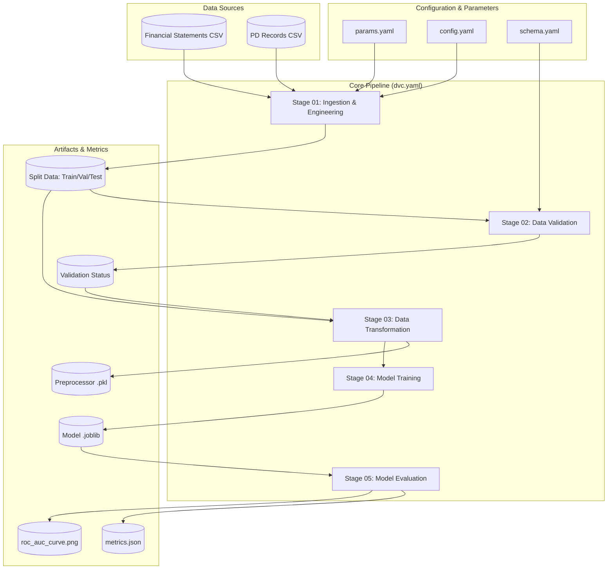

# DVC Pipeline Architecture Report

The Agentic Credit Risk Assessment System (ACRAS) uses **DVC (Data Version Control)** as the core orchestration engine for its MLOps pipeline. This ensures that every experiment is reproducible, traceable, and versioned alongside the code.

## Why This Is Critical
The DVC-centric architecture is the backbone of ACRAS for several reasons:
*   **Auditability**: In financial risk assessment, we must be able to prove exactly which data and which code version produced a specific risk score.
*   **Dependency Management**: DVC ensures that if we change a feature engineering ratio in `build_features.py`, the system *automatically* re-runs the ingestion, validation, and training stages.
*   **Storage Efficiency**: Large datasets and models are stored in external storage, keeping the Git repository lightweight.

## Architecture Diagram



## Pipeline Stages Breakdown

| Stage | Script | Primary Responsibility | Key Output |
| :--- | :--- | :--- | :--- |
| **01: Ingestion** | `stage_01_data_ingestion.py` | Load raw CSVs, Merge, Feature Engineering, Splitting. | `train.csv`, `val.csv`, `test.csv` |
| **02: Validation** | `stage_02_data_validation.py` | Schema enforcement and integrity check. | `status.txt` |
| **03: Transformation** | `stage_03_data_transformation.py` | Robust scaling and missing value imputation. | `preprocessor.pkl` |
| **04: Training** | `stage_04_model_trainer.py` | Baseline Random Forest fitting and serialization. | `acras_rf_model.joblib` |
| **05: Evaluation** | `stage_05_model_evaluation.py` | Metric calculation, ROC Plotting, and MLflow logging. | `metrics.json` |

## Strategy: The Dual-Entry Pattern
To balance production stability with developer velocity, ACRAS implements a **Dual-Entry Orchestration Strategy**:

| Entry Point | Utility | Philosophy |
| :--- | :--- | :--- |
| `uv run dvc repro` | **Production & Reproducibility** | Ensures the DAG is consistent. Uses caching to skip unchanged stages. |
| `uv run python main.py` | **Development & Debugging** | Forced linear execution. Ideal for IDE breakpoints and rapid logic iteration. |

## Reproduction Guide: Exact Results
To reproduce the current state of the pipeline bit-for-bit:

1.  **Sync Code**: Ensure you are on the correct Git commit.
    ```bash
    git checkout <commit_hash>
    ```
2.  **Sync Data**: Retrieve the exact data artifacts linked to that commit.
    ```bash
    uv run dvc pull
    ```
3.  **Validate State**: Check if your local environment matches the committed state.
    ```bash
    uv run dvc status
    ```
    *If it shows "Data and pipeline are up to date", the state is identical to the production/experiment record.*
4.  **Execute (if needed)**: If you've modified parameters/code and want to update the pipeline:
    ```bash
    uv run dvc repro
    ```
5.  **Commit Changes**: After a successful run, commit both the Git changes and the new `dvc.lock` file to anchor the new experiment state.
    ```bash
    git add dvc.lock ...
    git commit -m "Exp: Updated model hyperparameters"
    ```
