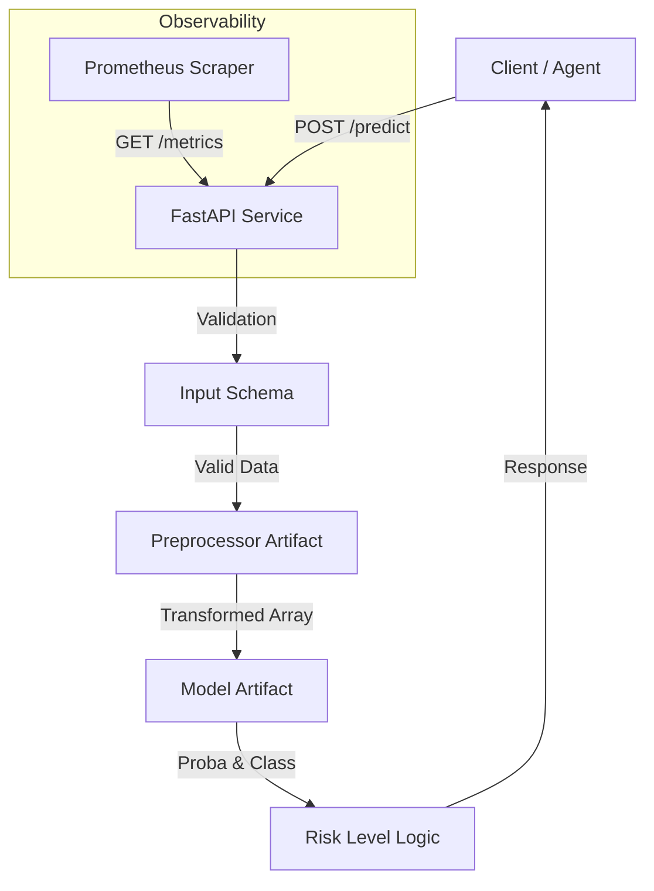

# Prediction Service Architecture Report

## Purpose
The **Prediction Service** exposes the trained Machine Learning model as a RESTful API, enabling other systems (e.g., frontend applications, batch processors) to consume credit risk predictions. It serves as the bridge between R&D artifacts and production usage.

## Architecture
The service is built on **FastAPI** for high performance and **Prometheus** for observability, containerized via **Docker**.



## Code Structure
The application follows a modular design to separate configuration from business logic:

| File | Description |
| :--- | :--- |
| `src/app/main.py` | **Application Entry Point**. Handles valid server configuration, lifespan events (model loading), and middleware (metrics). Includes routers from the API module. |
| `src/app/api/endpoints.py` | **Business Logic**. Contains the actual route definitions (`/health`, `/predict`) and inference logic using the loaded artifacts in `request.app.state`. |
| `src/app/api/__init__.py` | **Router Exposure**. Exposes the `api_router` for clean importing in `main.py`. |
| `src/app/schemas.py` | **Data Contracts**. Defines strict Pydantic models (`PredictionInput`, `PredictionOutput`) to validate all incoming and outgoing data. |

## Key Components
1.  **FastAPI Application**: 
    -   Handles HTTP requests asynchronously.
    -   Host: `0.0.0.0`
    -   Port: `8000` (Container Internal)

2.  **Lifespan Management**:
    -   Uses `@asynccontextmanager` to load heavy artifacts (Model, Preprocessor) **only once** at startup, not per request.
    -   Failure to load artifacts prevents the service from starting (Fail Fast).

3.  **Observability**:
    -   **Prometheus Instrumentator**: Automatically exposes latency, request count, and error rate metrics at `/metrics`.
    -   **Health Check**: `/health` endpoint for Kubernetes/Docker orchestration probing.

## Endpoints

| Method | Path | Description | Input | Output |
| :--- | :--- | :--- | :--- | :--- |
| `GET` | `/health` | Check service status | None | `{"status": "ok"}` |
| `POST` | `/predict` | Get credit risk prediction | `PredictionInput` (JSON) | `PredictionOutput` (JSON) |
| `GET` | `/metrics` | Prometheus metrics scrape target | None | Prometheus text format |

## Docker Integration
A `Dockerfile` is provided to package the application with all dependencies.
-   **Base Image**: `python:3.10-slim`
-   **Command**: `uvicorn src.app.main:app --host 0.0.0.0 --port 8000`

### Building and Running
To build the container:
```bash
docker build -t acras-prediction-service:v1 .
```

To run the service:
```bash
docker run -p 8000:8000 acras-prediction-service:v1
```

### Cleanup
To stop and remove the container to free up resources:
```bash
# Stop the running container
docker stop acras-prediction-service:v1

# Remove the container
docker rm acras-prediction-service:v1
```

## Error Handling
-   **503 Service Unavailable**: If model artifacts are not loaded.
-   **422 Unprocessable Entity**: If input data does not match the schema or prediction fails internally.

## API Usage Guide

### 1. Health Check
Verify the service is running and artifacts are loaded.

**Request:**
```bash
curl -X GET http://localhost:8000/health
```

**Response:**
```json
{
  "status": "ok",
  "service": "ACRAS-API"
}
```

### 2. Make a Prediction
Send a POST request with the company's financial data.

**Request:**
```bash
curl -X POST http://localhost:8000/predict \
  -H "Content-Type: application/json" \
  -d '{
    "ingresos": 5000000,
    "ebitda": 1000000,
    "activos_totales": 2000000,
    "pasivos_totales": 800000,
    "patrimonio": 1200000,
    "caja": 200000,
    "gastos_intereses": 50000,
    "cuentas_cobrar": 150000,
    "inventario": 100000,
    "cuentas_pagar": 80000,
    "sector_risk_score": 3.5,
    "years_operating": 5,
    "ratio_mora": 0.02,
    "ratio_utilizacion": 0.4,
    "revenue_growth": 0.1,
    "margen_beneficio": 0.2,
    "score_buro": 750,
    "ebitda_margin": 0.2,
    "debt_to_equity": 0.66,
    "current_ratio": 2.0
  }'
```

**Response:**
```json
{
  "prediction": 0,
  "probability": 0.19,
  "risk_level": "Low"
}
```

### 3. Check Metrics
Monitor the service performance via Prometheus format.

**Request:**
```bash
curl -X GET http://localhost:8000/metrics
```
