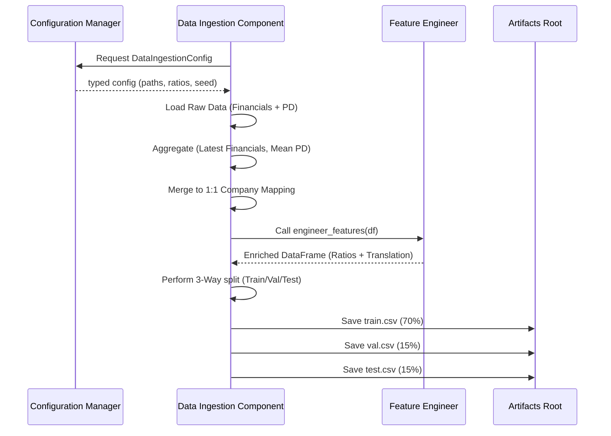

# Stage 01: Data Ingestion Architecture Report

## Purpose
The **Data Ingestion Stage** is responsible for establishing the data foundation for the entire risk assessment system. Its primary goal is to provide high-quality, reproducible data splits while abstracting away the source of the raw data.

## Workflow Logic
The component implements a robust 3-way split strategy to ensure unbiased model evaluation and hyperparameter tuning.

## Data Splitting Strategy
We use a **Double train_test_split** approach to achieve the specific ratios defined in `params.yaml`:

1.  **Split 1**: Data $\rightarrow$ `Train` and `Temp`.
    *   `Temp` size = `Val` + `Test` (e.g., 0.30).
2.  **Split 2**: `Temp` $\rightarrow$ `Validation` and `Test`.
    *   Executed using a relative ratio: `test_size / (test_size + val_size)`.

## Configuration Parameters
Managed in `params.yaml` under the `data_split` key:
*   `test_size`: 0.15
*   `val_size`: 0.15
*   `random_state`: 42 (Ensures bit-for-bit reproducibility of splits).

## Generated Artifacts
All artifacts are stored in `artifacts/data_ingestion/`:
*   `data.csv`: The base raw dataset.
*   `train.csv`: Training set used by the `Model Training` stage.
*   `val.csv`: Validation set used for hyperparameter tuning.
*   `test.csv`: Hold-out test set for final performance reporting.

## Why this is "Robust MLOps"
1.  **Strict Type Safety**: Use of `DataIngestionConfig` (dataclasses) and `ConfigBox` prevents "stringly-typed" errors and ensures parameters are validated at runtime.
2.  **Configuration Decoupling**: Hardcoded paths are forbidden. The component is agnostic of the environment, relying entirely on `config.yaml` and `params.yaml`.
3.  **Reproducible Splits**: By anchoring the `random_state` in the global `params.yaml`, the system guarantees that the same data partitions are generated every time, regardless of when or where the code runs.
4.  **3-Way Split Best Practices**: Separating a `Validation` set from the `Test` set prevents "data leakage" during hyperparameter optimization, ensuring the final metrics reflect true generalization performance.
