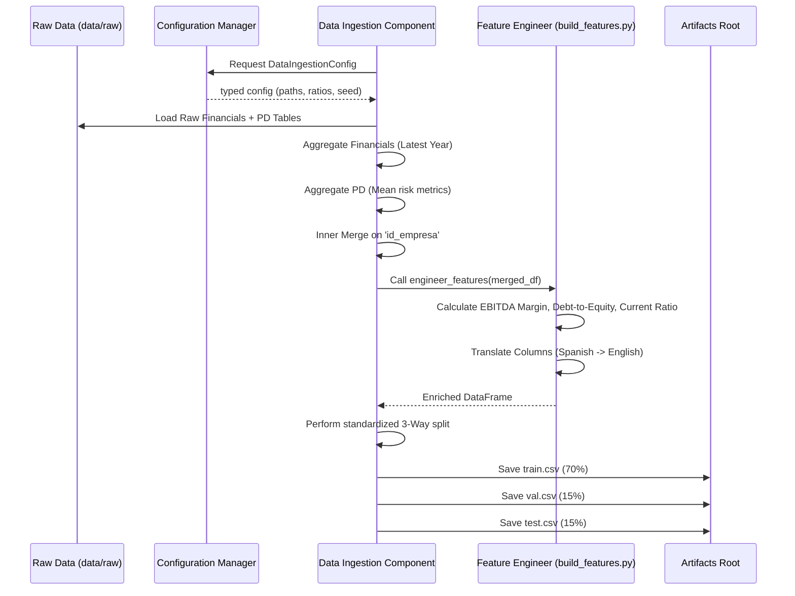

# Stage 01: Data Ingestion & Engineering Architecture Report

## Purpose
The **Data Ingestion & Engineering Stage** is responsible for establishing the numerical foundation for the ACRAS system. Its primary goal is to integrate raw financial and risk data, perform initial feature engineering (financial ratios), and provide reproducible data splits for downstream machine learning stages.

## Workflow Logic
This stage implements a sophisticated integration logic that merges disparate data sources while preventing "Cartesian Product" explosion through strategic aggregation.

## Integration & Engineering Strategy

### 1. Data Aggregation
To handle companies with multiple years of data or multiple PD records:
*   **Financials**: We select only the **LATEST** record per company (based on the `ano` column) to represent the current financial health.
*   **PD Records**: We calculate the **MEAN** of numerical risk factors to obtain a smoothed probability profile per entity.

### 2. Feature Engineering (build_features.py)
We transform the raw accounting data into predictive health indicators:
*   **EBITDA Margin**: Measures operational efficiency relative to revenue.
*   **Debt-to-Equity**: Assesses financial leverage and risk.
*   **Current Ratio**: Evaluates short-term liquidity and solvency.

### 3. Translation
To ensure the codebase adheres to English MLOps standards, all raw Spanish columns (e.g., `riesgo_sector`, `p_default`) are translated into our English schema (e.g., `sector_risk_score`, `target`).

## Data Splitting Strategy
We use a **Double train_test_split** approach to achieve the specific ratios defined in `config/params.yaml`:
1.  **Split 1**: Data $\rightarrow$ `Train` and `Temp`.
    *   `Temp` size = `Val` + `Test` (e.g., 0.30).
2.  **Split 2**: `Temp` $\rightarrow$ `Validation` and `Test`.
    *   Executed using a relative ratio: `test_size / (test_size + val_size)`.

## Configuration Parameters
Managed in `config/params.yaml` under the `data_split` key:
*   `test_size`: 0.15
*   `val_size`: 0.15
*   `random_state`: 42

## Generated Artifacts
All artifacts are stored in `artifacts/data_ingestion/`:
*   `train.csv`: Training set used by the `Model Training` stage.
*   `val.csv`: Validation set used for schema check and tuning.
*   `test.csv`: Hold-out test set for final performance reporting.

## Why this is "Robust MLOps"
1.  **Elimination of Redundancy**: Aggregation logic ensures a strict 1:1 mapping per company, preventing data bloating and bias.
2.  **Feature Consistency**: By moving translation and ratio calculation to the Ingestion stage, we ensure all downstream stages operate on a standardized, English-only schema.
3.  **Reproducible Geometry**: Anchoring the 3-way split with a fixed `random_state` ensures that every pipeline run uses the exact same data partitions.
