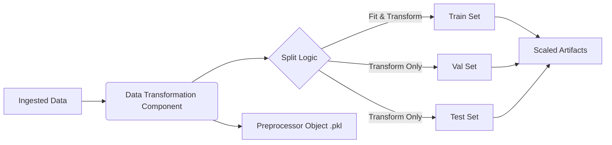

# Stage 02: Data Transformation Architecture Report

## Purpose
The **Data Transformation Stage** prepares the raw, enriched data for machine learning by standardizing the feature set. This stage ensures that the model receives data with consistent scale and distribution, which is critical for the stability and performance of gradient-based algorithms (like Neural Networks) and distance-based algorithms (like KNN or SVM).

## Workflow Logic
The transformation process uses a `scikit-learn` Pipeline to chain preprocessing steps, ensuring that the exact same transformations can be applied to new inference data without data leakage.

## Transformation Strategy

### 1. Feature Selection
We purposefully **exclude** the following columns from transformation to preserve their semantic meaning or target nature:
- `id_empresa`: Entity identifier (Metadata).
- `target`: The binary classification target (0/1).
- `default_probability`: The ground-truth probability (Metadata/Auxiliary Target).

All other numerical features (financials, ratios, scores) are treated as continuous variables to be scaled.

### 2. Preprocessing Pipeline
We employ a robust two-step pipeline:

1.  **Imputation (`SimpleImputer`)**:
    *   **Strategy**: `median`.
    *   **Reasoning**: Financial data often contains outliers (e.g., massive revenue spikes). The median is robust to these outliers, unlike the mean, ensuring that missing values are filled with a representative central value without being skewed by extremes.

2.  **Scaling (`StandardScaler`)**:
    *   **Strategy**: Z-score Normalization ($z = \frac{x - \mu}{\sigma}$).
    *   **Reasoning**:
        *   Centers data around 0 with a standard deviation of 1.
        *   Essential for models that assume normally distributed errors or rely on the magnitude of weights (e.g., Logistic Regression with regularization).
        *   Prevents features with large magnitudes (like `Total Assets` in millions) from dominating features with small magnitudes (like `Leverage Ratio`).

## Reproducibility & Leakage Prevention
*   **Fit on Train, Transform on All**: The scaler and imputer statistics (median, mean, std) are calculated **only** on the Training set. These learned parameters are then applied to Validation and Test sets.
    *   *Why?* This prevents "Data Leakage". If we calculated the mean of the entire dataset, information from the Test set would leak into the Training process, leading to overly optimistic performance estimates.
*   **Serialized Preprocessor**: The fitted pipeline is saved as `preprocessor.pkl`. This exact object must be loaded during inference to transform new live data, ensuring consistent behavior between training and production.

## Generated Artifacts
Location: `artifacts/data_transformation/`
*   `train.csv`, `val.csv`, `test.csv`: Transformed datasets ready for model training.
*   `preprocessor.pkl`: The serialized scikit-learn pipeline object.

## Why this is "Robust MLOps"
*   **Elimination of Data Leakage**: By enforcing a strict "Fit-on-Train, Transform-on-All" policy, we ensure that information from the validation and test sets does not influence the preprocessing parameters, preserving the integrity of model evaluation.
*   **Training-Serving Symmetry**: The serialization of the `preprocessor.pkl` artifact ensures that the exact same transformation logic and statistical parameters used during training are applied during real-time inference. This eliminates "Training-Serving Skew," a common cause of production model failure.
*   **Atomic & Versioned Artifacts**: The stage produces immutable data artifacts and a serialized pipeline, enabling full auditability and the ability to roll back to specific feature engineering states.
*   **Pipeline Modularity**: Using a `scikit-learn` Pipeline decouples data preparation from model logic, allowing for independent iteration on feature engineering without risk of breaking the downstream training or deployment code.
