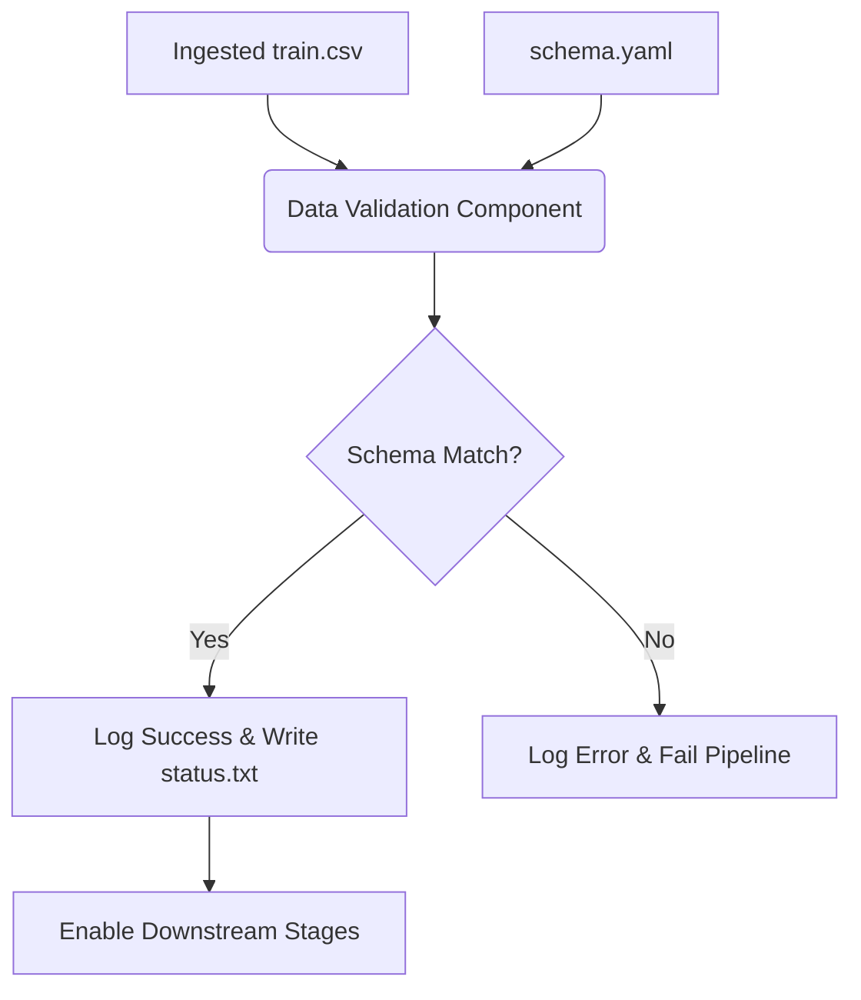

# Stage 02: Data Validation Architecture Report

## Purpose
The **Data Validation Stage** acts as the quality firewall of the ACRAS pipeline. It ensures that the ingested data perfectly matches the predefined `config/schema.yaml` before it enters the expensive transformation and training phases. This stage is critical for preventing "Silent Failures" and "Garbage In, Garbage Out" scenarios.

## Workflow Logic
The validation component compares the dynamic structure of the ingested CSV files against the immutable contract defined in the project's schema.

## Validation Strategy

### 1. Column Existence Check
The system iterates through all columns in the `train.csv` and verifies they exist in `config/schema.yaml`. If an unknown column is present, the pipeline fails.

### 2. Schema Integrity
Conversely, the system ensures that every column required by the schema is present in the data. This is vital for the `Data Transformation` stage, which expects specific numerical and categorical columns to be present for the `ColumnTransformer`.

### 3. Status Reporting
The outcome of the validation is written to a version-controlled file:
*   **Artifact**: `artifacts/data_validation/status.txt`
*   **Content**: `Validation status: True` or a detailed log of missing/unexpected columns.

## Configuration Parameters
*   **Schema**: Defined in `config/schema.yaml`.
*   **Status File Path**: Managed via `config/config.yaml` (`data_validation.STATUS_FILE`).

## Why this is "Robust MLOps"
1.  **Contract-First Development**: By validating against a schema, we treat data as a contract. Any change in the data upstream (e.g., a field being renamed in the raw source) is caught immediately here.
2.  **Safety in Automation**: In an automated CI/CD or DVC trigger environment, this stage prevents the consumption of "poisoned" or empty datasets by the model.
3.  **Traceability**: The `status.txt` artifact provides a persistent record of the data health for every DVC experiment run, aiding in auditability.
4.  **Early Failure**: Failing the pipeline at Stage 02 saves computational resources (and costs) by not proceeding to training if the data is structurally invalid.
