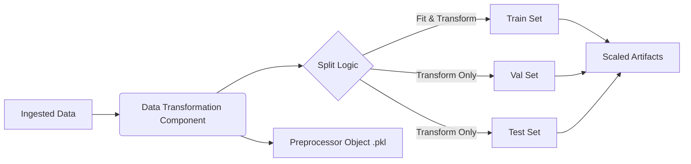

# Stage 03: Data Transformation Architecture Report

## Purpose
The **Data Transformation Stage** prepares the validated data for machine learning by standardizing the feature set. This stage ensures that the model receives data with consistent scale and distribution, which is critical for the stability and performance of gradient-based algorithms and distance-based algorithms.

## Workflow Logic
The transformation process uses a `scikit-learn` Pipeline to chain preprocessing steps, ensuring that the exact same transformations can be applied to new inference data without data leakage.

## Transformation Strategy

### 1. Feature Selection
We purposefully **exclude** the following columns from transformation to preserve their semantic meaning or target nature:
- `id_empresa`: Entity identifier (Metadata).
- `ano`: Time identifier (Metadata).
- `target`: The binary classification target (0/1).
- `default_probability`: The ground-truth probability (Auxiliary Record).

### 2. Preprocessing Pipeline
We employ a robust two-step pipeline for all numerical markers:

1.  **Imputation (`SimpleImputer`)**:
    *   **Strategy**: `median`.
    *   **Reasoning**: Financial data often contains outliers. The median is robust to these extremes, ensuring that missing values are filled with a representative central value.

2.  **Scaling (`RobustScaler`)**:
    *   **Strategy**: Interquartile Range (IQR) Scaling.
    *   **Reasoning**:
        *   Unlike `StandardScaler`, `RobustScaler` uses the median and the IQR, making it robust to outliers.
        *   Essential for financial datasets (like this one) where specific companies might have significantly larger balances than the average.
        *   Prevents extreme values from skewing the distribution of the entire feature.

## Reproducibility & Leakage Prevention
*   **Fit on Train, Transform on All**: The scaler and imputer statistics are calculated **only** on the Training set. These learned parameters are then applied to Validation and Test sets.
*   **Serialized Preprocessor**: The fitted pipeline is saved as `preprocessor.pkl`. This exact object must be loaded during inference to transform new live data, ensuring consistent behavior between training and production.

## Generated Artifacts
Location: `artifacts/data_transformation/`
*   `train.csv`, `val.csv`, `test.csv`: Transformed datasets ready for model training.
*   `preprocessor.pkl`: The serialized scikit-learn pipeline object.

## Why this is "Robust MLOps"
*   **Elimination of Data Leakage**: Information from the validation/test sets does not influence the preprocessing parameters.
*   **Training-Serving Symmetry**: The serialization of the `preprocessor.pkl` artifact ensures that the exact same transformation logic and statistical parameters used during training are applied during real-time inference.
*   **Outlier Resilience**: The use of `RobustScaler` ensures that the model's feature space isn't destroyed by high-variance financial data.
