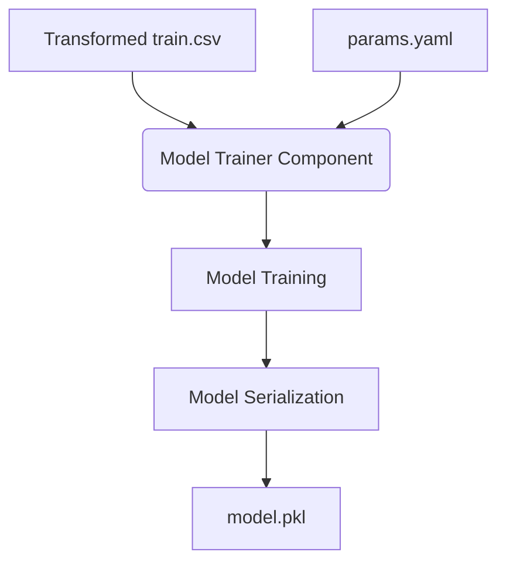

# Stage 04: Model Training Architecture Report

## Purpose
The **Model Training Stage** is the final execution phase of the ACRAS training pipeline. It consumes the transformed artifacts to produce a predictive model that can classify companies into "High Risk" or "Low Risk" categories based on their financial health.

## Workflow Logic
The training stage implements a baseline **Random Forest** classifier, optimized for tabular financial data.

## Training Strategy

### 1. Algorithm Selection
We use a **Random Forest Classifier** for the baseline:
*   **Reasoning**: High explainability (Feature Importance), non-linear relationship capturing, and inherent resistance to overfitting through ensemble voting.

### 2. Hyperparameter Management
All model parameters are centralized in `config/params.yaml`:
*   `n_estimators`: 300 (Ensures a stable ensemble).
*   `min_samples_leaf`: 5 (Prevents the model from growing too deep and memorizing noise).
*   `class_weight`: `balanced` (Crucial for risk assessment since credit defaults are typically minority classes).

### 3. Training Process
*   The component loads the transformed `train.csv`.
*   The `target` column is separated as the dependent variable.
*   The model is fitted using the specific `random_state` (42) to ensure that re-runs produce the exact same model weights.

## Reproducibility & Traceability
*   **Seed Control**: By using a fixed random seed, we ensure that the stochastic nature of Random Forest (bagging, feature sub-sampling) is neutralized for reproducibility.
*   **Versioned Model**: The resulting `.pkl` file is tracked by DVC, allowing us to roll back to any historical model version.

## Generated Artifacts
Location: `artifacts/model_trainer/`
*   `model.pkl`: The serialized model object (Random Forest).

## Why this is "Robust MLOps"
1.  **Hyperparameter Decoupling**: Hardcoded parameters are forbidden. The `ModelTrainer` receives hyperparameters solely through the `ModelTrainerConfig` entity, populated from `config/params.yaml`.
2.  **Imbalance Handling**: Using `class_weight='balanced'` ensures the model doesn't simply predict "No Default" for everyone to achieve high accuracy, which would be disastrous for a risk system.
3.  **Audit Ready**: Every training run is linked to specific data versions through DVC, ensuring a 1:1 mapping between data, code, and the final model weights.
