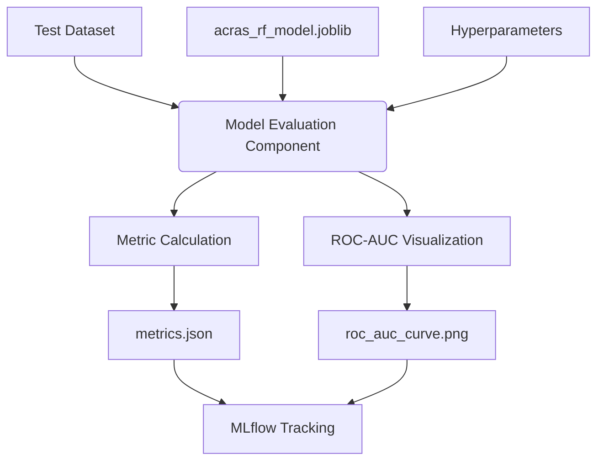

# Stage 05: Model Evaluation Architecture Report

## Purpose
The **Model Evaluation Stage** is the final quality gate of the ACRAS training pipeline. It rigorously assesses the performance of the trained model using unseen data (`test.csv`) and generates both quantitative metrics and visual diagnostics to ensure the model's readiness for production.

## Workflow Logic
The evaluation stage integrates standard scikit-learn metrics with advanced MLflow tracking and automated visualization.

## Evaluation Strategy

### 1. Performance Metrics
We calculate a comprehensive suite of metrics to evaluate the classifier from multiple perspectives:
*   **Accuracy**: Overall proportion of correct predictions.
*   **Precision**: Ability to avoid flagging low-risk companies as high-risk.
*   **Recall**: Ability to capture as many high-risk companies as possible (Critical for Risk).
*   **F1 Score**: Harmonic mean of Precision and Recall.
*   **ROC-AUC**: Measures the model's ability to distinguish between classes regardless of the probability threshold.

### 2. Visualization (ROC Curve)
The stage automatically generates a **Receiver Operating Characteristic (ROC)** curve.
*   **Local Artifact**: Saved as `artifacts/model_evaluation/roc_auc_curve.png`.
*   **Insight**: Helps the "Brain" (Agent) understand the trade-off between True Positive Rate and False Positive Rate.
*   **Robustness**: The plotting logic includes a fallback for imbalanced test sets (e.g., if only one class is present) to prevent pipeline failures.

### 3. MLflow Integration
Every evaluation run is logged as a unique experiment in MLflow for deep observability:
*   **Experiment**: `ACRAS_Risk_Assessment`
*   **Run Name**: Timestamped for traceability (e.g., `RF_Eval_2026_02_12_16_19`).
*   **Artifacts**: The model is logged under a descriptive name (`acras_risk_model`) and the ROC plot is attached to the run.

## Generated Artifacts
Location: `artifacts/model_evaluation/`
*   **`metrics.json`**: Machine-readable evaluation scores (used by DVC).
*   **`roc_auc_curve.png`**: Visual diagnostics of classifier performance.

## Why this is "Robust MLOps"
1.  **Fault-Tolerant Tracking**: The system detects if an MLflow server is available and falls back to local file-based tracking (`./mlruns`) if necessary, ensuring the pipeline never breaks due to external connectivity issues.
2.  **DVC Metrics**: By registering `metrics.json` as a DVC metric, we can use `dvc metrics diff` to compare performance across different iterations directly from the CLI.
3.  **Automated Plotting**: Visual evidence of model quality is generated automatically, removing the need for manual notebook-based evaluation.
4.  **Meaningful Registration**: Models are registered with unique versions and descriptive names, making it easier for the "Model Pusher" stage to identify candidates for deployment.
