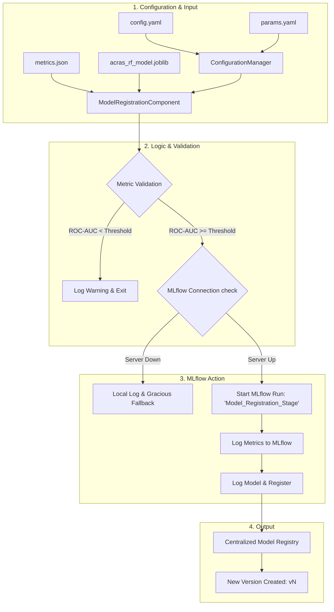
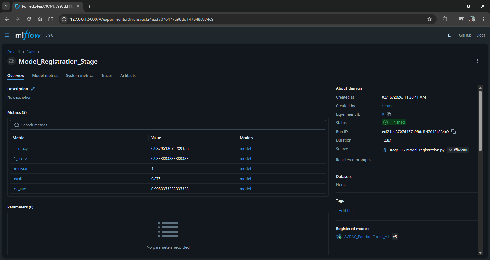

# Stage 06: Model Registration Architecture Report

## Purpose
The **Model Registration Stage** acts as the final decision-maker in the ACRAS training pipeline. Its primary objective is to transition a high-performing model from a local artifact state into a centralized, versioned **Model Registry**. This ensures that only models meeting predefined performance thresholds are made available for downstream deployment services.

## Workflow Logic
This stage evaluates the model's metrics against a "quality gate" before interacting with the MLflow Model Registry.

## Implementation Details

### 1. The Quality Gate (Thresholding)
To prevent suboptimal models from reaching the registry, the component implements a hard threshold:
*   **Metric**: ROC-AUC
*   **Threshold**: `0.60` as global configuration (can be changed in `config/params.yaml`).
*   **Behavior**: If the model's ROC-AUC is below this value, the registration process is aborted with a warning. This ensures the integrity of the "Staging" and "Production" model pools.

### 2. MLflow Registry Integration
The component utilizes the `mlflow.sklearn.log_model` function with the `registered_model_name` parameter. This atomic operation:
1.  Uploads the model artifact (`.joblib`) to the MLflow tracking server.
2.  Creates a new version under the registered model name.
3.  Logs the final evaluation metrics directly to the registration run for traceability.

### 3. Fault-Tolerant Connection
In alignment with the "Antigravity" standards, the component includes a fallback mechanism:
*   If the MLflow server is unreachable (e.g., local development without a running docker container), the component logs a warning and proceeds without crashing the pipeline.
*   This allows DVC to track the stage completion locally even if centralized tracking is temporarily offline.

## Evidence of Registration
The following screenshot illustrates a successful registration run in the MLflow UI, showing the transition of metrics and the creation of version **v5** for the `ACRAS_RandomForest_v1` model.

## Why this is "Robust MLOps"
1.  **Centralized Governance**: By using a Model Registry, we move away from "local file" dependencies. The Prediction API can now pull models by name and version (e.g., `models:/ACRAS_RandomForest_v1/Staging`).
2.  **Automated Versioning**: Every successful pipeline run automatically increments the model version, providing a clear audit trail of improvement.
3.  **Performance Guarantees**: The quality gate ensures that we never accidentally promote a model that performs worse than a random guess.
4.  **Decoupled Architecture**: Stage 06 can be run independently of the evaluation stage as long as the `metrics.json` artifact is present, allowing for manual re-registration if needed.
