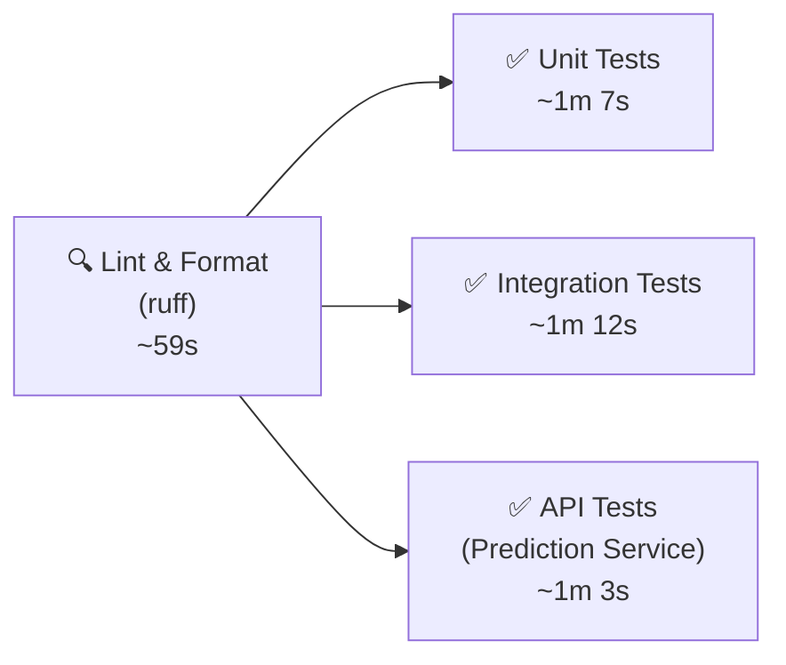
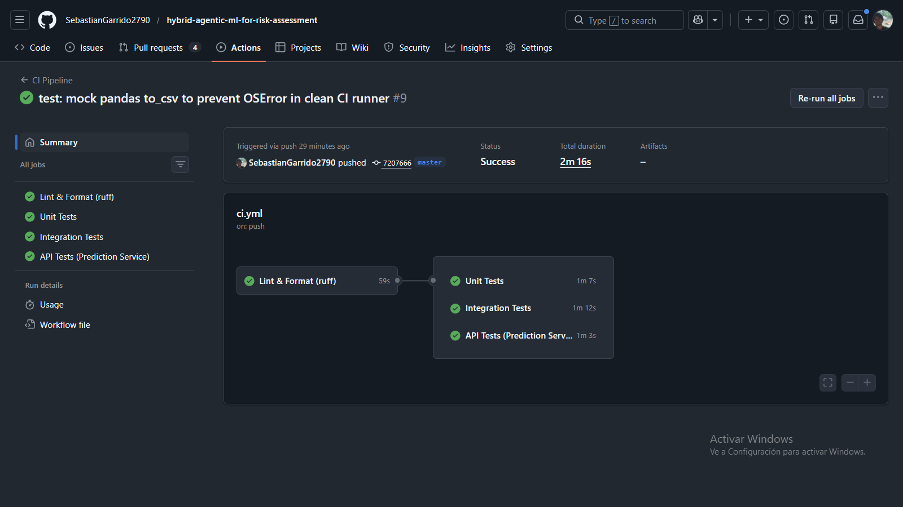

# CI Pipeline Report — ACRAS
**Date:** 2026-03-08 | **Branch:** `master` | **Repository:** `SebastianGarrido2790/hybrid-agentic-ml-for-risk-assessment`

---

## 1. Overview

This document describes the fully automated Continuous Integration (CI) pipeline implemented for the Agentic Credit Risk Assessment System (ACRAS). The pipeline enforces software quality gates on every push and pull request, using **GitHub Actions** as the CI orchestration platform.

The pipeline is intentionally aligned with modern 2026 MLOps practices:
- **Modular workflow files** with a clear separation of concerns
- **`uv`-native dependency caching** for near-instant repeated runs
- **Fail-fast lint gate** before any expensive test execution
- **Parallel test jobs** for maximum developer feedback speed
- **`concurrency` groups** that cancel stale runs on new pushes

---

## 2. Workflow Architecture

Three independent workflow files govern CI automation:

| File | Trigger | Purpose |
| :--- | :--- | :--- |
| `.github/workflows/ci.yml` | Push/PR to `master`, manual dispatch | Main quality pipeline: lint → parallel tests |
| `.github/workflows/docker-build.yml` | Push/PR to `master` on Docker-related file changes | Validates Dockerfile builds successfully |
| `.github/dependabot.yml` | Automated (weekly, Mondays) | Opens PRs to bump stale `pip` and `github-actions` dependencies |

---

## 3. CI Pipeline (`ci.yml`) — Job Graph

The main pipeline executes four jobs. All test jobs are **gated behind the lint job** via `needs: [lint]`, meaning broken code is rejected in under 60 seconds before any test runner is provisioned.



**Latest successful run:** Commit `7207666` · **Total duration: 2m 16s**

### 3.1 Job Details

**`lint` — Lint & Format (ruff)**
- Runs `ruff check . --output-format=github` (pycodestyle, pyflakes, isort, pyupgrade rules)
- Runs `ruff format --check .`
- All jobs are blocked until this passes

**`test-unit` — Unit Tests**
- Executes `uv run pytest tests/unit/ -v`
- Covers: data ingestion, data transformation, data validation, model trainer, config, and agent tools
- 10 tests · All mocked (no filesystem or external service I/O)

**`test-integration` — Integration Tests**
- Executes `uv run pytest tests/integration/ -v`
- Covers: end-to-end DVC pipeline stage execution

**`test-api` — API Tests (Prediction Service)**
- Executes `uv run pytest tests/app/ -v`
- Covers: FastAPI `/health` and `/predict` endpoints, including risk category mapping and service unavailability

### 3.2 Caching Strategy

Every job uses `astral-sh/setup-uv@v5` with `enable-cache: true` and a `uv.lock`-keyed cache. This means the ~3GB dependency graph only downloads on the first run after a lockfile change — subsequent runs resolve from cache in milliseconds.

### 3.3 System Dependency Note

`xhtml2pdf` (used for PDF report generation) pulls in `pycairo`, which requires the `libcairo2-dev` C library to compile. The `ubuntu-latest` GitHub Actions runner does not include this by default. Each job installs it explicitly before `uv sync`:

```yaml
- name: Install system dependencies (libcairo2 for xhtml2pdf)
  run: sudo apt-get update && sudo apt-get install -y --no-install-recommends pkg-config libcairo2-dev
```

---

## 4. Successful Pipeline Run



*Figure: GitHub Actions run #9 — `ci.yml` with all four jobs passing in 2m 16s. The DAG clearly shows the `Lint & Format (ruff)` gate completing before the three parallel test runners are launched.*

---

## 5. Docker Build Validation (`docker-build.yml`)

The Docker workflow triggers on changes to `Dockerfile`, `docker-compose.yaml`, `pyproject.toml`, `uv.lock`, or anything under `src/`. It uses `docker/build-push-action@v6` with **GitHub Actions build cache** (`type=gha`) to avoid re-downloading base layers.

> **IMPORTANT:** ML model artifacts (`acras_rf_model.joblib`, `preprocessor.pkl`, `val.csv`) are gitignored and produced only by the local DVC pipeline (`uv run dvc repro`). The Docker workflow creates empty dummy placeholder files before building so the `COPY` instructions in the Dockerfile do not fail in the clean CI environment. The image is **not pushed** to any registry; this is a smoke test only.

**Run #1 result:** ✅ `Success` · Total duration: **21m 29s** (cold build, no cache). Subsequent runs with warm cache are significantly faster.

---

## 6. Dependabot Automation

The `dependabot.yml` file is an optional configuration file used to manage how GitHub Dependabot monitors and updates your project's dependencies. Automatically creates pull requests (PRs) to keep dependencies at their latest versions.

Dependabot was automatically activated upon merging `dependabot.yml` and immediately opened **four PRs** grouping the stale dependencies it detected:

| PR | Ecosystem | Status |
| :--- | :--- | :--- |
| #1 | pip (pyproject.toml) | Draft |
| #2 | pip (pyproject.toml) | Draft |
| #3 | github-actions | ✅ Passed Dependabot Updates check |
| #4 | github-actions | ✅ Passed Dependabot Updates check |

The `github-actions` ecosystem checks ran in under 51 seconds each and passed cleanly.

---

## 7. Branch Protection — Recommended Configuration

> **WARNING:** GitHub is currently displaying the warning **"Your master branch isn't protected"**. This warning appeared because adding GitHub Actions status checks signals to GitHub that you now have automated quality gates — but those gates are useless if code can still be pushed directly to `master` without passing them.

### Why the Warning Appeared
Before CI existed, GitHub treated this repository as a code storage location. Once `.github/workflows/ci.yml` was pushed, the platform detected active status checks and surfaced the protection warning proactively — a sign the repository has matured into a professional MLOps project.

### Recommended Ruleset Configuration

Navigate to **Settings → Rules → Rulesets → New branch ruleset** and configure as follows:

| Setting | Recommended Value | Rationale |
| :--- | :--- | :--- |
| **Ruleset Name** | `Master Branch Protection` | Descriptive label |
| **Enforcement Status** | `Active` | Must be active to take effect |
| **Target Branches** | `Include default branch` | Targets `master` automatically |
| **Restrict deletions** | ✅ Enabled | Prevents accidental deletion of `master` |
| **Require a pull request before merging** | ✅ Enabled | No direct pushes to `master` |
| **Required approvals** | `0` | Solo developer — avoids self-review deadlock |
| **Require status checks to pass** | ✅ Enabled | Core enforcement mechanism |
| **Required status checks** | Add all four below | See table |
| **Block force pushes** | ✅ Enabled | Prevents history rewriting |

**Required Status Checks to Add (click "+ Add checks"):**

```
Lint & Format (ruff)
Unit Tests
Integration Tests
API Tests (Prediction Service)
```

Once active, the `master` branch can only be updated through a Pull Request where all four CI checks show a green checkmark. This transforms the repository from a personal code store into a professionally governed MLOps project with automated quality enforcement.

---

## 8. Incident Log

| Date | Commit | Issue | Resolution |
| :--- | :--- | :--- | :--- |
| 2026-03-08 | `63b7d10` | `pycairo` failed to compile — `cairo` system library not found on runner | Added `sudo apt-get install libcairo2-dev pkg-config` step to all CI jobs |
| 2026-03-08 | `02fbb4f` | `test_initiate_data_ingestion` raised `OSError` on clean runner — `os.makedirs` was mocked but `to_csv` was not | Patched `pandas.DataFrame.to_csv` in the test to prevent filesystem I/O |
| 2026-03-08 | `7207666` | ✅ All 4 jobs green — CI pipeline fully operational | — |
