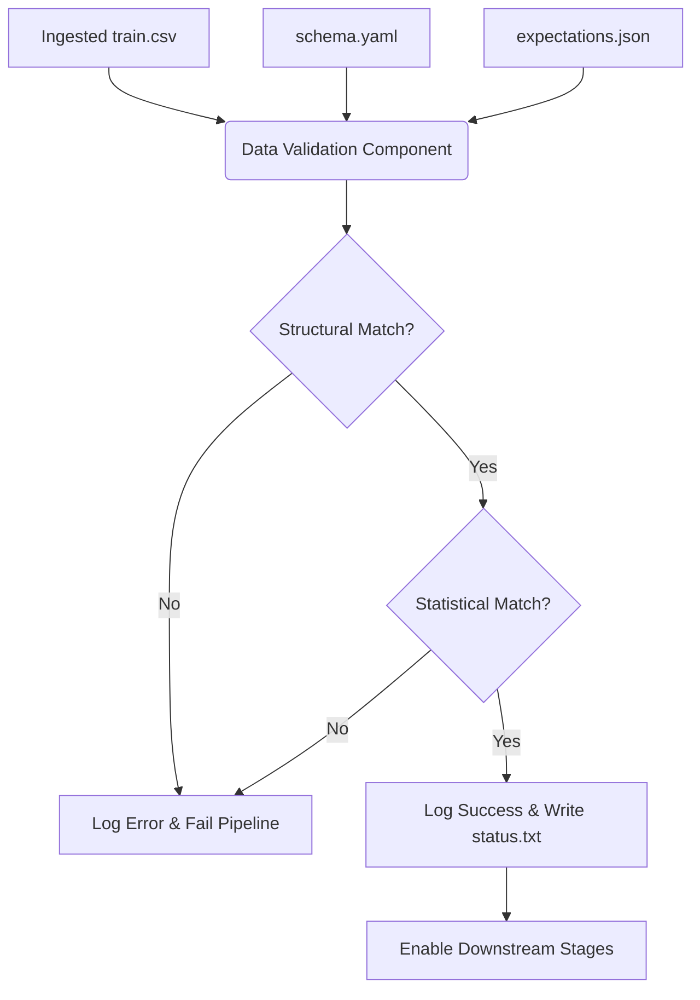

# Stage 02: Data Validation Architecture Report

## Purpose
The **Data Validation Stage** acts as the quality firewall of the ACRAS pipeline. It implements a **Dual-Contract Approach** to ensure that the ingested data is both structurally sound and statistically reliable before it enters the expensive transformation and training phases. This stage is critical for preventing "Silent Failures" and "Garbage In, Garbage Out" scenarios.

## Workflow Logic
The validation component performs a multi-layer check, comparing the ingested CSV files against both a structural schema (`schema.yaml`) and a statistical quality contract (`expectations.json`).

## Validation Strategy

### 1. Structural Validation (Schema Enforcement)
The system enforces a rigid structural contract defined in `config/schema.yaml`:
*   **Column Existence Check**: Verifies that no unknown columns are present in the ingested data.
*   **Schema Integrity**: Ensures that every required column (numerical and categorical) is present to satisfy downstream `ColumnTransformer` requirements.
*   **Target Presence**: Confirms the target column is available for supervised learning.

### 2. Statistical Validation (Great Expectations)
To go beyond basic structure, ACRAS utilizes **Great Expectations (GX)** to enforce data quality and distribution contracts:
*   **Null Value Protection**: `expect_column_values_to_not_be_null` ensures critical financial features aren't empty.
*   **Domain Constraints**: `expect_column_values_to_be_between` enforces business logic (e.g., non-negative income, bounded ratios).
*   **Categorical Integrity**: `expect_column_values_to_be_in_set` validates that classification features follow the expected labels.

### 3. Status Reporting
The outcome of the validation is written to a version-controlled artifact:
*   **Artifact**: `artifacts/data_validation/status.txt`
*   **Content**: `Validation status: True` or a detailed log of the specific contract violation (Structural or Statistical).

## Configuration Parameters
*   **Structural Schema**: Defined in `config/schema.yaml`.
*   **Statistical Expectations**: Defined in `config/expectations.json`.
*   **Status File Path**: Managed via `config/config.yaml` (`data_validation.STATUS_FILE`).

## Operational Hardening (v2.0)
The validation stage utilizes the project-wide observability stack for elite traceability:

### 1. Structured Logging & Telemetry
*   **Dual-Layer Reporting**: Validation outcomes are logged at the `INFO` or `ERROR` level, ensuring violations are visible in both the local `status.txt` and the centralized log file.
*   **OpenTelemetry Integration**: Statistical validation results are captured in OTel spans, allowing for real-time monitoring of data quality health.

### 2. MLflow Tracking
*   **Metric Logging**: Pass/fail status and specific quality metrics (e.g., % of nulls) are logged to MLflow when running in a pipeline context, enabling historical tracking of data drift.

### 3. Standardized Exceptions
*   **Failure Loudly**: Replaced unstructured error prints with `CustomException`. This ensures that any contract violation (structural or statistical) terminates the pipeline with a clear, file/line-level traceback.

## Why this is "Robust MLOps"
1.  **Contract-First Development**: Data is treated as a formal contract. Any upstream shift in data generation is caught before it pollutes the model.
2.  **Statistical Guardrails**: Prevents training on "poisoned" data that might pass a schema check but contains nonsensical values (e.g., negative loan durations).
3.  **Traceability**: Every DVC experiment is linked to a specific `status.txt` record of the data health at that moment.
4.  **Resource Optimization**: Failing at Stage 02 saves significant computational time and cloud costs by blocking invalid data from reaching GPU-intensive training.
5.  **Auditability**: Provides a clear audit trail for regulatory compliance, proving that the model was trained on validated, high-quality data.
