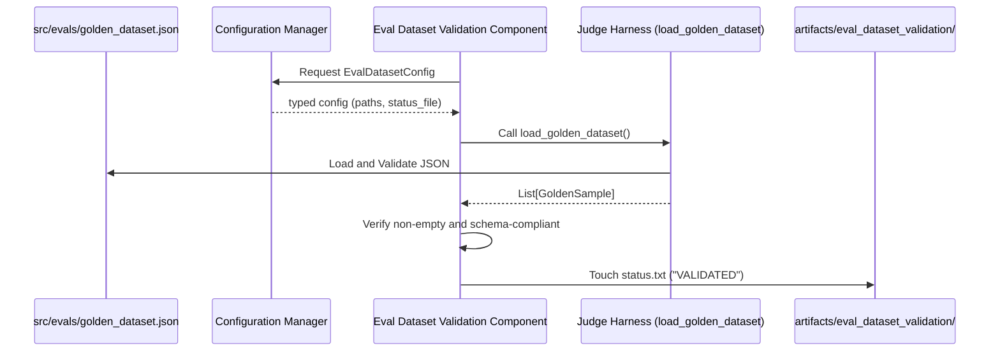

# Stage 07: Evaluation Dataset Validation Architecture Report

## Purpose
The **Evaluation Dataset Validation Stage** is the final integrity gate before the qualitative assessment phase. Its primary goal is to ensure that the **Golden Dataset** (ground truth) is structurally sound, available, and complies with the versioned schema before the resource-intensive "LLM-as-a-Judge" harness executes.

## Workflow Logic
This stage validates the loading of the ground truth dataset and signals its readiness through artifact creation.

## Validation Strategy

### 1. Schema Enforcement
The component uses the `load_golden_dataset` utility from the judge harness, which leverages **Pydantic** models (`GoldenSample`) with `extra="forbid"`. This ensures:
*   All required fields (`sample_id`, `company_id`, `input_query`, etc.) are present.
*   Data types are strictly enforced (e.g., `company_id` is an integer).
*   Literal values for `expected_recommendation` and `expected_risk_tier` are restricted to valid business categories.

### 2. DVC Pipeline Signaling
By outputting a `status.txt` file, this stage acts as a dependency for the evaluation suite. DVC ensures that:
*   The evaluation suite cannot run if validation fails.
*   The validation only re-runs if `golden_dataset.json` or the validation logic changes.

## Configuration Parameters
Managed in `config/config.yaml` under the `eval_dataset_validation` key and mapped to `EvalDatasetConfig`:
*   `root_dir`: `artifacts/eval_dataset_validation`
*   `status_file`: `artifacts/eval_dataset_validation/status.txt`

## Generated Artifacts
All artifacts are stored in `artifacts/eval_dataset_validation/`:
*   `status.txt`: A sentinel file containing the string `"VALIDATED"`, signaling that the golden dataset is ready for consumption.

## Operational Hardening (v2.3)
This stage has been implemented using the project's most advanced design patterns:

### 1. Standardized Component Structure
The validation logic is encapsulated in a dedicated class (`EvalDatasetValidation`) with Google-style docstrings, ensuring clarity for both developers and AI agents.

### 2. Strict Configuration Typing
Uses `EvalDatasetConfig` (dataclass) and `EvalDatasetYamlConfig` (Pydantic BaseModel) to enforce strict YAML-to-Python type safety at the boundary.

### 3. "Python-Development" Standard Compliance
*   **Strong Typing**: Fully typed inputs and outputs.
*   **Structured Logging**: Uses `get_logger(__name__)` to record the validation lifecycle.
*   **Clean Separation**: Decoupled from the actual evaluation execution, following the "separation of concerns" principle.

## Why this is "Elite MLOps"
1.  **Fail-Fast Integrity**: Prevents the execution of expensive LLM-based evaluation suites on corrupted or malformed datasets.
2.  **Explicit Data Contracts**: Treating the golden dataset as a versioned artifact with a strict schema ensures long-term reproducibility of qualitative assessments.
3.  **DVC Integration**: Full DAG integration allows for efficient caching and clear lineage tracing of the evaluation prerequisites.
4.  **Auditability**: The `status.txt` artifact provides a physical record of the validation event within the MLOps lifecycle.
